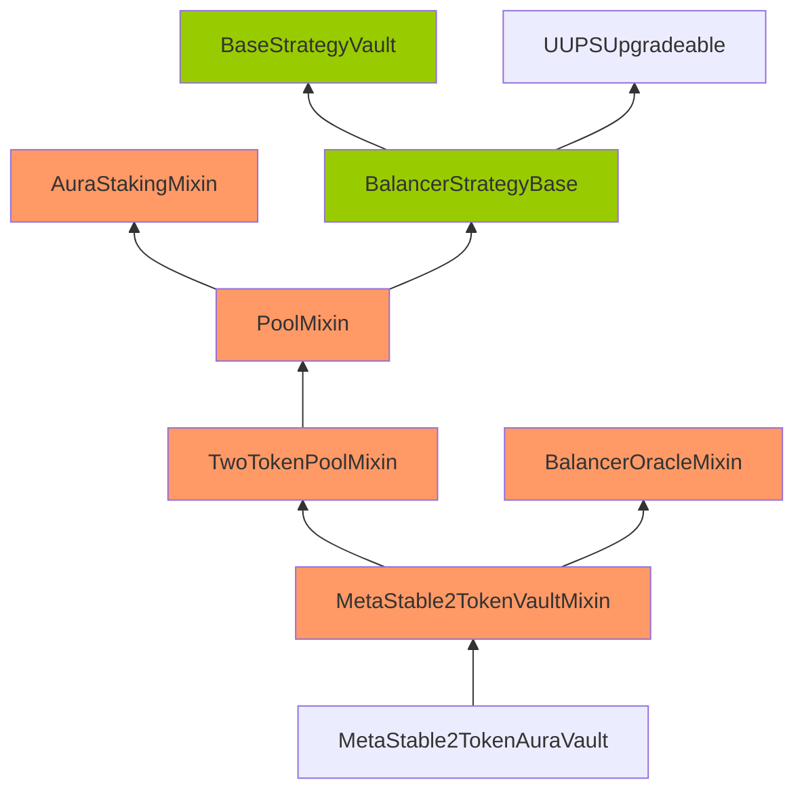
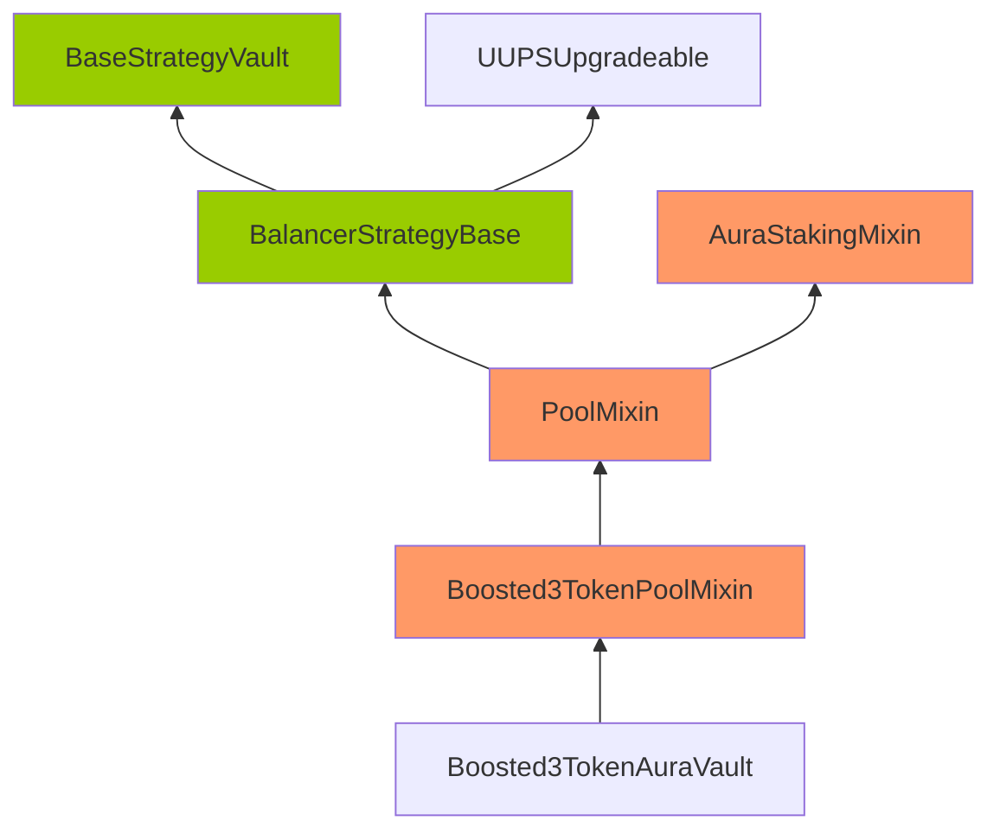

xiaoming90

medium

# Corruptible Upgradability Pattern

## Summary

Storage of Boosted3TokenAuraVault and MetaStable2TokenAuraVault vaults might be corrupted during an upgrade.

## Vulnerability Detail

Following are the inheritance of the Boosted3TokenAuraVault and MetaStable2TokenAuraVault vaults.

Note: The contracts highlighted in Orange mean that there are no gap slots defined. The contracts highlighted in Green mean that gap slots have been defined

**Inheritance of the MetaStable2TokenAuraVault vault**




**Inheritance of the Boosted3TokenAuraVault vault**



The Boosted3TokenAuraVault and MetaStable2TokenAuraVault vaults are meant to be upgradeable. However, it inherits contracts that are not upgrade-safe. 

The gap storage has been implemented on the `BaseStrategyVault` and `BalancerStrategyBase` contracts inherited by the Boosted3TokenAuraVault and MetaStable2TokenAuraVault vaults.

https://github.com/sherlock-audit/2022-09-notional/blob/main/leveraged-vaults/contracts/vaults/BaseStrategyVault.sol#L14

```solidity
abstract contract BaseStrategyVault is Initializable, IStrategyVault {
    using TokenUtils for IERC20;
    using TradeHandler for Trade;
    ..SNIP..
    // Storage gap for future potential upgrades
    uint256[45] private __gap;
}
```

https://github.com/sherlock-audit/2022-09-notional/blob/main/leveraged-vaults/contracts/vaults/balancer/BalancerStrategyBase.sol#L9

```solidity
abstract contract BalancerStrategyBase is BaseStrategyVault, UUPSUpgradeable {
    /** Immutables */
    uint32 internal immutable SETTLEMENT_PERIOD_IN_SECONDS;
    ..SNIP..
    // Storage gap for future potential upgrades
    uint256[100] private __gap;
}
```

However, no gap storage is implemented on the `Boosted3TokenPoolMixin`, `MetaStable2TokenVaultMixin`, `TwoTokenPoolMixin`, `PoolMixin`, `AuraStakingMixin` and `BalancerOracleMixin` contracts inherited by the Boosted3TokenAuraVault and MetaStable2TokenAuraVault vaults. 

Thus, adding new storage variables to any of these inherited contracts can potentially overwrite the beginning of the storage layout of the child contract. causing critical misbehaviors in the system.

## Impact

Storage of Boosted3TokenAuraVault and MetaStable2TokenAuraVault vaults might be corrupted during upgrading, thus causing the vaults to be broken and assets to be stuck.

## Code Snippet

https://github.com/sherlock-audit/2022-09-notional/blob/main/leveraged-vaults/contracts/vaults/BaseStrategyVault.sol#L14
https://github.com/sherlock-audit/2022-09-notional/blob/main/leveraged-vaults/contracts/vaults/balancer/BalancerStrategyBase.sol#L9

## Tool used

Manual Review

## Recommendation

Consider defining an appropriate storage gap in each upgradeable parent contract at the end of all the storage variable definitions as follows:

```solidity
uint256[50] __gap; // gap to reserve storage in the contract for future variable additions
```

#### Reference

A similar issue was found in the past audit report:

- https://blog.openzeppelin.com/notional-audit/ - [M02] Adding new variables to multi-level inherited upgradeable contracts may break storage layout