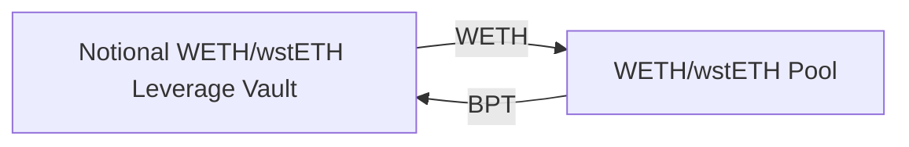
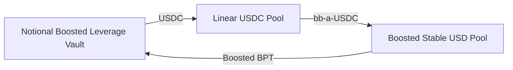

xiaoming90

medium

# Boosted Balancer Leverage Vault Might Not Be Able To Exit Its Position

## Summary

The boosted balancer leverage vault might not be able to exit its position under certain conditions as the BPT threshold check was not performed against all the involved Balancer pools.

## Vulnerability Detail

Per the Notional walkthrough video (see [4:11min](https://youtu.be/YbtM6dzFRVs?t=251)), the reason for having the BPT threshold is to ensure that the strategy does not hold too large of a share of the liquidity within the pool. Otherwise, the strategy will have a problem exiting its position.

At Line 335-342, if the number of BPT the vault held within a pool after joining exceeds the BPT threshold, the code will revert.

https://github.com/sherlock-audit/2022-09-notional/blob/main/leveraged-vaults/contracts/vaults/balancer/internal/pool/Boosted3TokenPoolUtils.sol#L325

```solidity
File: Boosted3TokenPoolUtils.sol
325:     function _joinPoolAndStake(
326:         ThreeTokenPoolContext memory poolContext,
327:         StrategyContext memory strategyContext,
328:         AuraStakingContext memory stakingContext,
329:         BoostedOracleContext memory oracleContext,
330:         uint256 deposit,
331:         uint256 minBPT
332:     ) internal returns (uint256 bptMinted) {
333:         bptMinted = _joinPoolExactTokensIn(poolContext, deposit, minBPT);
334: 
335:         // Check BPT threshold to make sure our share of the pool is
336:         // below maxBalancerPoolShare
337:         uint256 bptThreshold = strategyContext.vaultSettings._bptThreshold(
338:             poolContext._getVirtualSupply(oracleContext)
339:         );
340:         uint256 bptHeldAfterJoin = strategyContext.totalBPTHeld + bptMinted;
341:         if (bptHeldAfterJoin > bptThreshold)
342:             revert Errors.BalancerPoolShareTooHigh(bptHeldAfterJoin, bptThreshold);
343: 
344:         // Transfer token to Aura protocol for boosted staking
345:         stakingContext.auraBooster.deposit(stakingContext.auraPoolId, bptMinted, true); // stake = true
346:     }
```

**Balancer WETH/wstETH Pool**

The following diagram shows the workflow for WETH/wstETH Balancer leverage vault during depositing. The leverage vault will join the WETH/wstETH Pool with the appropriate amount of WETH. Subsequently, the appropriate amount of BPT will be minted for the leverage vault. 

In this context, if the number of BPT held by the vault exceeds 20% of the total supply of WETH/wsETH tokens, the transaction will revert to ensure that the strategy does not hold more than 20% of the total supply of WETH/wsETH BPT tokens. This is to ensure that the strategy will not have a problem exiting its position later.

The current design of BPT threshold check works perfectly for WETH/wstETH Balancer leverage vault in ensuring the vault remains liquidity.




**Balancer Boosted Aave USD Pool (bb-a-USD)**

The following diagram shows the workflow for Boosted Balancer leverage vault during depositing. First, the leverage vault will swap in an appropriate amount of USDC to the Linear USDC Pool and receive an appropriate amount of BPT (bb-a-USDC) back. Next, the BPT (bb-a-USDC) will be swapped into the Boosted Stable USDC Pool, and an appropriate amount of Boosted BPT received back.

In this context, if the number of Boosted BPT held by the vault exceeds 20% of the total supply of Boosted BPT, the transaction will revert to ensure that the strategy does not hold more than 20% of the total supply of Boosted BPT tokens. This is to ensure that the strategy will not have a problem exiting its Boosted BPT position later.

The current design of BPT threshold works fine for MetaStable2Token vault. However, it does not work well for Boosted3Token vault. When the vault is trying to exit its position, the exact opposite will happen. The vault will not have any problem exiting from the Boosted Stable USD Pool because the code has ensured that the vault will never hold too large of a share of the liquidity within the Boosted Stable USD Pool.

However, the problem is that when exiting the Linear USDC Pool, there might not be sufficient liquidity within the Linear USDC Pool for the vault to exit its bb-a-USDC BPT position. This is because the code did not check whether or not the vault was holding too large of a share of the liquidity within the Linear USDC Pool. Thus, the vault will be illiquid and cannot exit its position.



The following code shows how the workflow for depositing/joining a Boosted Balancer Pool works.

https://github.com/sherlock-audit/2022-09-notional/blob/main/leveraged-vaults/contracts/vaults/balancer/internal/pool/Boosted3TokenPoolUtils.sol#L234

```solidity
File: Boosted3TokenPoolUtils.sol
234:     function _joinPoolExactTokensIn(ThreeTokenPoolContext memory context, uint256 primaryAmount, uint256 minBPT)
235:         private returns (uint256 bptAmount) {
236:         IBoostedPool underlyingPool = IBoostedPool(address(context.basePool.primaryToken));
237: 
238:         // Swap underlyingToken for LinearPool BPT
239:         uint256 linearPoolBPT = BalancerUtils._swapGivenIn({
240:             poolId: underlyingPool.getPoolId(),
241:             tokenIn: underlyingPool.getMainToken(),
242:             tokenOut: address(underlyingPool),
243:             amountIn: primaryAmount,
244:             limit: 0 // slippage checked on the second swap
245:         });
246: 
247:         // Swap LinearPool BPT for Boosted BPT
248:         bptAmount = BalancerUtils._swapGivenIn({
249:             poolId: context.basePool.basePool.poolId,
250:             tokenIn: address(underlyingPool),
251:             tokenOut: address(context.basePool.basePool.pool), // Boosted pool
252:             amountIn: linearPoolBPT,
253:             limit: minBPT
254:         });
255:     }
```

## Impact

The Boosted Balancer leverage vault will be illiquid and cannot exit its position.

## Code Snippet

https://github.com/sherlock-audit/2022-09-notional/blob/main/leveraged-vaults/contracts/vaults/balancer/internal/pool/Boosted3TokenPoolUtils.sol#L325
https://github.com/sherlock-audit/2022-09-notional/blob/main/leveraged-vaults/contracts/vaults/balancer/internal/pool/Boosted3TokenPoolUtils.sol#L234

## Tool used

Manual Review

## Recommendation

For Boosted Balancer leverage vault, consider implementing a BPT threshold check on both the Linear USDC Pool and Boosted Stable USD Pool.

Implement the same for the DAI variant of the Boosted Balancer leverage vault.