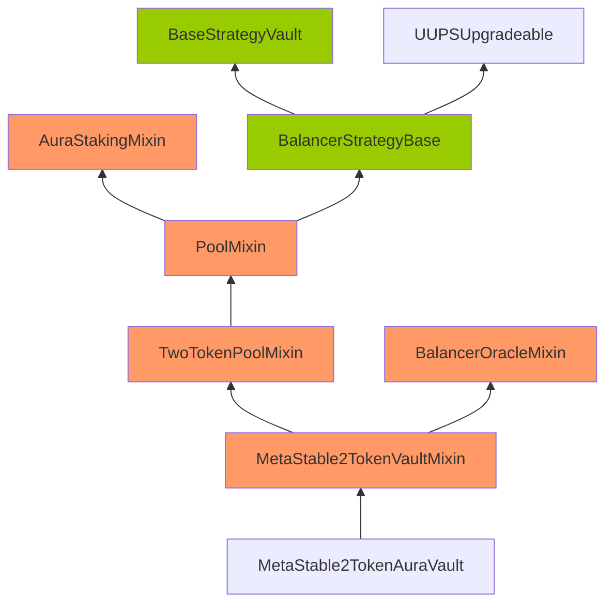
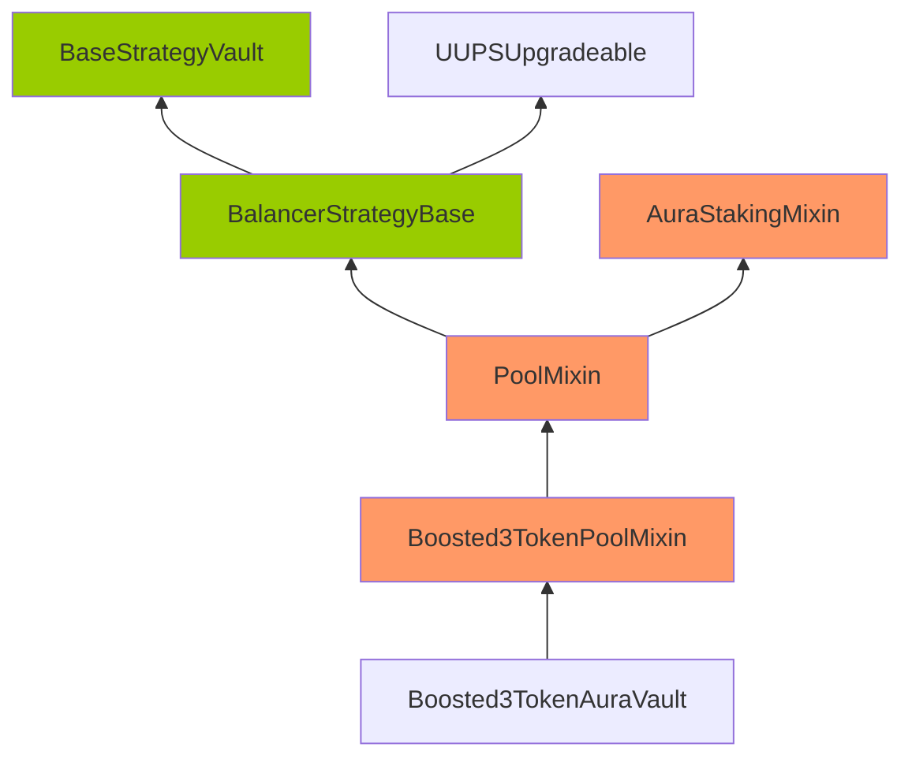

# Issue H-1: `TradingUtils._executeTrade()` doesn't check `preTradeBalance` properly. 

Source: https://github.com/sherlock-audit/2022-09-notional-judging/issues/110 

## Found by 
0x52, lemonmon, hansfriese

## Summary
`TradingUtils._executeTrade()` doesn't check `preTradeBalance` properly.

## Vulnerability Detail
`TradingUtils._executeTrade()` doesn't check `preTradeBalance` properly.

```solidity
function _executeTrade(
    address target,
    uint256 msgValue,
    bytes memory params,
    address spender,
    Trade memory trade
) private {
    uint256 preTradeBalance;

    if (trade.sellToken == address(Deployments.WETH) && spender == Deployments.ETH_ADDRESS) {
        preTradeBalance = address(this).balance;
        // Curve doesn't support Deployments.WETH (spender == address(0))
        uint256 withdrawAmount = _isExactIn(trade) ? trade.amount : trade.limit;
        Deployments.WETH.withdraw(withdrawAmount);
    } else if (trade.sellToken == Deployments.ETH_ADDRESS && spender != Deployments.ETH_ADDRESS) {
        preTradeBalance = IERC20(address(Deployments.WETH)).balanceOf(address(this));
        // UniswapV3 doesn't support ETH (spender != address(0))
        uint256 depositAmount = _isExactIn(trade) ? trade.amount : trade.limit;
        Deployments.WETH.deposit{value: depositAmount }();
    }

    (bool success, bytes memory returnData) = target.call{value: msgValue}(params);
    if (!success) revert TradeExecution(returnData);

    if (trade.buyToken == address(Deployments.WETH)) {
        if (address(this).balance > preTradeBalance) {
            // If the caller specifies that they want to receive Deployments.WETH but we have received ETH,
            // wrap the ETH to Deployments.WETH.
            uint256 depositAmount;
            unchecked { depositAmount = address(this).balance - preTradeBalance; }
            Deployments.WETH.deposit{value: depositAmount}();
        }
    } else if (trade.buyToken == Deployments.ETH_ADDRESS) {
        uint256 postTradeBalance = IERC20(address(Deployments.WETH)).balanceOf(address(this));
        if (postTradeBalance > preTradeBalance) {
            // If the caller specifies that they want to receive ETH but we have received Deployments.WETH,
            // unwrap the Deployments.WETH to ETH.
            uint256 withdrawAmount;
            unchecked { withdrawAmount = postTradeBalance - preTradeBalance; }
            Deployments.WETH.withdraw(withdrawAmount);
        }
    }
}
```

It uses `preTradeBalance` to manage the WETH/ETH deposits and withdrawals.

But it doesn't save the correct `preTradeBalance` for some cases.

- Let's assume `trade.sellToken = some ERC20 token(not WETH/ETH), trade.buyToken = WETH`
- Before executing the trade, `preTradeBalance` will be 0 as both `if` conditions are false.
- Then all ETH inside the contract will be converted to WETH and considered as a `amountBought` [here](https://github.com/sherlock-audit/2022-09-notional/blob/main/leveraged-vaults/contracts/trading/TradingUtils.sol#L143-L149) and [here](https://github.com/sherlock-audit/2022-09-notional/blob/main/leveraged-vaults/contracts/trading/TradingUtils.sol#L61).
- After all, all ETH of the contract will be lost.
- All WETH of the contract will be lost also when `trade.sellToken = some ERC20 token(not WETH/ETH), trade.buyToken = ETH` [here](https://github.com/sherlock-audit/2022-09-notional/blob/main/leveraged-vaults/contracts/trading/TradingUtils.sol#L151-L158).

## Impact
All of ETH/WETH balance of the contract might be lost in some cases.

## Code Snippet
https://github.com/sherlock-audit/2022-09-notional/blob/main/leveraged-vaults/contracts/trading/TradingUtils.sol#L118-L160

## Tool used
Manual Review

## Recommendation
We should check `preTradeBalance` properly. We can remove the current code for `preTradeBalance` and insert the below code before executing the trade.

```solidity
if (trade.buyToken == address(Deployments.WETH)) {
    preTradeBalance = address(this).balance;
} else if (trade.buyToken == Deployments.ETH_ADDRESS) {
    preTradeBalance = IERC20(address(Deployments.WETH)).balanceOf(address(this));
}
```

## Discussion

**jeffywu**

@weitianjie2000 


# Issue H-2: `StrategyUtils::_executeDynamicTradeExactIn` does not wrap steth 

Source: https://github.com/sherlock-audit/2022-09-notional-judging/issues/99 

## Found by 
0x52, lemonmon

## Summary

`StrategyUtils::_executeDynamicTradeExactIn` will return bought steth value instead of wrapped steth. Also, steth is not wrapped as it is supposed to be.

## Vulnerability Detail

In the `StrategyUtils::_executeDynamicTradeExactIn`, if `params.tradeUnwrapped` is true, and `buyToken` is `WRAPPED_STETH`, the `buyToken` will be updated to be `WRAPPED_STETH.stETH()`, which is basically `STHETH` (not wrapped). (line 62 in StrategyUtils). So, it buys `stETH` in the trade, and the `amountBought` will be the amount of `stETH` bought. But the `amountBought` was expected to be the `WRAPPED_STETH` amount, as the buyToken given as `WRAPPED_STETH`. The `WRAPPED_STETH` and `STETH` are not 1 to 1, so an user can get more amountBought or less amountBought depending on the market than what is actually bought in `WRAPPED_STETH`.

Later in the same function (line 80-90), if `params.tradeUnwrapped` is true and `buyToken` is `WRAPPED_STETH` and the `amountBought` is bigger than zero, it will wrap the bought stETH to `WARPPED_STETH` and update the `amountBought` to the `WRAPPED_STETH` value. However, this code will be never reached, because if the first two conditions are met, the buyToken would be updated to the `stETH` in the above (line 62).

For example, 100 Wrapped steth will give 108 steth. So, If I choose trade unwrapped to be true, I will get 108 steth, which will be 100 wrapped steth, and get 100 amountBought. But, since my steth bought will not be wrapped, the amountBought returned will be 108, with the buyToken wrapped steth.

## Impact

`StrategyUtils::_executeDynamicTradeExactIn` will return not correct `amountBought`, which will be used in other parts of contract.
If `WRAPPED_STETH` is more expensive, which appears to be the case currently, then an attacker can get more than what is actually sold.

Also, the steth is not wrapped as it is supposed to be, and it leads to accounting error.

## Code Snippet

https://github.com/sherlock-audit/2022-09-notional/blob/main/leveraged-vaults/contracts/vaults/balancer/internal/strategy/StrategyUtils.sol?plain=1#L41-L91

```solidity
FILE: StrategyUtils.sol

 41     function _executeDynamicTradeExactIn(
 42         DynamicTradeParams memory params,
 43         ITradingModule tradingModule,
 44         address sellToken,
 45         address buyToken,
 46         uint256 amount
 47     ) internal returns (uint256 amountSold, uint256 amountBought) {
 48         require(
 49             params.tradeType == TradeType.EXACT_IN_SINGLE || params.tradeType == TradeType.EXACT_IN_BATCH
 50         );
 51
 52         // stETH generally has deeper liquidity than wstETH, setting tradeUnwrapped
 53         // to lets the contract trade in stETH instead of wstETH
 54         if (params.tradeUnwrapped && sellToken == address(Deployments.WRAPPED_STETH)) {
 55             sellToken = Deployments.WRAPPED_STETH.stETH();
 56             uint256 unwrappedAmount = IERC20(sellToken).balanceOf(address(this));
 57             // NOTE: the amount returned by unwrap is not always accurate for some reason
 58             Deployments.WRAPPED_STETH.unwrap(amount);
 59             amount = IERC20(sellToken).balanceOf(address(this)) - unwrappedAmount;
 60         }
 61         if (params.tradeUnwrapped && buyToken == address(Deployments.WRAPPED_STETH)) {
 62             buyToken = Deployments.WRAPPED_STETH.stETH();
 63         }
 64
 65         // Sell residual secondary balance
 66         Trade memory trade = Trade(
 67             params.tradeType,
 68             sellToken,
 69             buyToken,
 70             amount,
 71             0,
 72             block.timestamp, // deadline
 73             params.exchangeData
 74         );
 75
 76         (amountSold, amountBought) = trade._executeTradeWithDynamicSlippage(
 77             params.dexId, tradingModule, params.oracleSlippagePercent
 78         );
 79
 80         if (
 81             params.tradeUnwrapped &&
 82             buyToken == address(Deployments.WRAPPED_STETH) &&
 83             amountBought > 0
 84         ) {
 85             IERC20(buyToken).checkApprove(address(Deployments.WRAPPED_STETH), amountBought);
 86             uint256 wrappedAmount = Deployments.WRAPPED_STETH.balanceOf(address(this));
 87             /// @notice the amount returned by wrap is not always accurate for some reason
 88             Deployments.WRAPPED_STETH.wrap(amountBought);
 89             amountBought = Deployments.WRAPPED_STETH.balanceOf(address(this)) - wrappedAmount;
 90         }
 91     }
```

## Tool used

Manual Review

## Recommendation

Rather than overwriting the buyToken, use a new local variable for the stEth, to differentiate when `tradeUnwrapped` is true and buyToken was steth, vs `tradeUnwrapped` is true and buyToken was wrapped steth, which was then overwritten to steth.
Only when `tradeUnwrapped` is true and the original `buyToken` is wrapped steth, convert bought steth to wrapped steth.

Or do not allow `tradeUnwrapped` to be true when buyToken is steth, and overwrite buyToken as steth. Then, if tradeUnwrapped is true and buyToken is steth, wrap the bought steth.


## Discussion

**jeffywu**

@weitianjie2000 


# Issue H-3: `TradingUtils::_executeTrade` will leak ETH to WETH 

Source: https://github.com/sherlock-audit/2022-09-notional-judging/issues/98 

## Found by 
lemonmon

## Summary

If sellToken is ETH, and using Uniswap for the dex, and it is exact out trade, too much is deposited to the WETH and does not withdraw the excess amount. It will give wrong `amountSold` value as well as accounting error.

## Vulnerability Detail

`trade.sellToken` is ETH and using Uniswap as dex, WETH should be used instead of ETH as Uniswap does not support ETH. There for TradingUtils wraps the ETH to WETH before trading.

If the trade would be exact out, the amount `trade.limit` will be deposited to WETH instead of the `trade.amount`. However, because it is exact out, not all ETH deposited will be traded. In the current implementation, there is no logic to recover the excess deposit.

As the `TradingUtils::_executeInternal`, which uses the `TradingUtils::_executeTrade` will calculate the `amountSold` based on the balance of ETH, it will return the `trade.limit` as the `amountSold`, thus resulting in accounting error.

Note: in the current implementation, the trade using Uniswap with ETH as sellToken would not even work, because the WETH is not properly approved (issue 2). This issue assumes that the issue is resolved. 

## Impact

`amountSold` will reflect not the amount really sold, rather the `trade.limit`. It is unclear whether the excess amount of ETH, which is deposited for WETH can be recovered.

## Code Snippet

https://github.com/sherlock-audit/2022-09-notional/blob/main/leveraged-vaults/contracts/trading/TradingUtils.sol?plain=1#L118-L137

https://github.com/sherlock-audit/2022-09-notional/blob/main/leveraged-vaults/contracts/trading/TradingUtils.sol?plain=1#L29-L64


## Tool used

Manual Review

## Recommendation

In the `_executeTrade`, if the sellToken is ETH and it is exact out trade, recover excess deposit.


## Discussion

**jeffywu**

@Evert0x I don't think this is a duplicate of #110

**weitianjie2000**

legit issue, will be fixed


# Issue H-4: Bought/Purchased Token Can Be Sent To Attacker's Wallet Using 0x Adaptor 

Source: https://github.com/sherlock-audit/2022-09-notional-judging/issues/75 

## Found by 
xiaoming90

## Summary

The lack of recipient validation against the 0x order within the 0x adaptor (`ZeroExAdapter`) allows the purchased/output tokens of the trade to be sent to the attacker's wallet.

## Vulnerability Detail

#### Background

**How does the emergency vault settlement process work?**

1. Anyone can call the `settleVaultEmergency` function to trigger the emergency vault settlement as it is permissionless
2. The `_getEmergencySettlementParams` function will calculate the excess BPT tokens within the vault to be settled/sold
3. The amount of excess BPT tokens will be converted to an equivalence amount of strategy tokens to be settled
4. The strategy tokens will be settled by withdrawing staked BPT tokens from Aura Finance back to the vault for redemption.
5. The vault will then redeem the BTP tokens from Balancer to redeem its underlying assets (WETH and stETH)
6. The primary and secondary assets of the vault are WETH and stETH respectively. The secondary asset (stETH) will be traded for the primary asset (WETH) in one of the supported DEXes. In the end, only the primary assets (WETH) should remain within the vault.
7. The WETH within the vault will be sent to Notional, and Notional will mint the asset tokens (cEther) for the vault in return.
8. After completing the emergency vault settlement process, the vault will gain asset tokens (cEther) after settling/selling its excess BPT tokens.

#### Issue Description

The caller of the `settleVaultEmergency` function can specify the trade parameters to sell the secondary tokens (stETH) for primary tokens (WETH) in any of the supported 5 DEX protocols (Curve, Balancer V2, Uniswap V2 & V3 and 0x) in Step 5 of the above emergency vault settlement process.

After analyzing the adaptors of 5 DEX protocols (Curve, Balancer V2, Uniswap V2 & V3 and 0x), it was observed that Curve, Balancer V2, Uniswap V2, and Uniswap V3 are designed in a way that the purchased tokens can only be returned to the vault.

Take the Uniswap V2 adaptor as an example. When the vault triggers the trade execution, it will always pass its own address `address(this)` to the `from` parameter of the `getExecutionData` function. The value of `from` parameter will be passed to the `to` parameter of Uniswap's `swapExactTokensForTokens` function, which indicates the recipient of the output/purchased tokens. Therefore, it is impossible for the caller to specify the recipient of the output tokens to another address. This is also the same for Curve, Balancer V2, and Uniswap V3.

https://github.com/sherlock-audit/2022-09-notional/blob/main/leveraged-vaults/contracts/trading/adapters/UniV2Adapter.sol#L12

```solidity
File: UniV2Adapter.sol
12:     function getExecutionData(address from, Trade calldata trade)
..SNIP..
31:             executionCallData = abi.encodeWithSelector(
32:                 IUniV2Router2.swapExactTokensForTokens.selector,
33:                 trade.amount,
34:                 trade.limit,
35:                 data.path,
36:                 from,
37:                 trade.deadline
38:             );
```

Note: Specification of `swapExactTokensForTokens` function can be found at https://docs.uniswap.org/protocol/V2/reference/smart-contracts/router-02#swapexacttokensfortokens

However, this is not implemented for the 0x adaptor (`ZeroExAdapter`). The `from` of the `getExecutionData` is completely ignored, and the caller has the full flexibility of crafting an order that benefits the caller.

https://github.com/sherlock-audit/2022-09-notional/blob/main/leveraged-vaults/contracts/trading/adapters/ZeroExAdapter.sol#L7

```solidity
File: ZeroExAdapter.sol
07: library ZeroExAdapter {
08:     /// @dev executeTrade validates pre and post trade balances and also
09:     /// sets and revokes all approvals. We are also only calling a trusted
10:     /// zero ex proxy in this case. Therefore no order validation is done
11:     /// to allow for flexibility.
12:     function getExecutionData(address from, Trade calldata trade)
13:         internal view returns (
14:             address spender,
15:             address target,
16:             uint256 /* msgValue */,
17:             bytes memory executionCallData
18:         )
19:     {
20:         spender = Deployments.ZERO_EX;
21:         target = Deployments.ZERO_EX;
22:         // msgValue is always zero
23:         executionCallData = trade.exchangeData;
24:     }
25: }
```

A number of features are supported by 0x. The full list of the supported features can be found [here](https://docs.0x.org/protocol/docs/exchange-proxy/features). Specifically, the following are the functions of attacker interest because it allows the attacker to configure the `recipient` parameter so that the bought tokens will be redirected to the attacker's wallet instead of the vault.

- LiquidityProviderFeature - [sellToLiquidityProvider](https://github.com/0xProject/protocol/blob/6f72a8e8e3306fa6cc77081547192c4f630ca316/contracts/zero-ex/contracts/src/features/LiquidityProviderFeature.sol#L86)

```solidity
    /// @dev Sells `sellAmount` of `inputToken` to the liquidity provider
    ///      at the given `provider` address.
    /// @param inputToken The token being sold.
    /// @param outputToken The token being bought.
    /// @param provider The address of the on-chain liquidity provider
    ///        to trade with.
    /// @param recipient The recipient of the bought tokens. If equal to
    ///        address(0), `msg.sender` is assumed to be the recipient.
    /// @param sellAmount The amount of `inputToken` to sell.
    /// @param minBuyAmount The minimum acceptable amount of `outputToken` to
    ///        buy. Reverts if this amount is not satisfied.
    /// @param auxiliaryData Auxiliary data supplied to the `provider` contract.
    /// @return boughtAmount The amount of `outputToken` bought.
    function sellToLiquidityProvider(
        IERC20TokenV06 inputToken,
        IERC20TokenV06 outputToken,
        ILiquidityProvider provider,
        address recipient,
        uint256 sellAmount,
        uint256 minBuyAmount,
        bytes calldata auxiliaryData
    )
```

- UniswapV3Feature - [sellTokenForTokenToUniswapV3](https://github.com/0xProject/protocol/blob/6f72a8e8e3306fa6cc77081547192c4f630ca316/contracts/zero-ex/contracts/src/features/UniswapV3Feature.sol#L160)

```solidity
    /// @dev Sell a token for another token directly against uniswap v3.
    /// @param encodedPath Uniswap-encoded path.
    /// @param sellAmount amount of the first token in the path to sell.
    /// @param minBuyAmount Minimum amount of the last token in the path to buy.
    /// @param recipient The recipient of the bought tokens. Can be zero for sender.
    /// @return buyAmount Amount of the last token in the path bought.
    function sellTokenForTokenToUniswapV3(
        bytes memory encodedPath,
        uint256 sellAmount,
        uint256 minBuyAmount,
        address recipient
    )
```

The malicious user could perform the following actions to steal the assets:

- Allow malicious users to specify the recipient of the output/purchased tokens to be themselves instead of the vault. This will cause the output/purchased tokens of the trade to be redirected to the malicious users instead of the vault
- Specify the `minBuyAmount` parameter of the order to `1 WEI` so that he only needs to provide `1 WEI` to fill the order to obtain all the secondary token (stETH) that need to be sold. This is allowed as there is no slippage control within 0x adaptor (Refer to my "No Slippage Control If The Trade Executes Via 0x DEX During Emergency Vault Settlement" issue write-up)

## Impact

Attackers can craft a 0x order that redirects the assets to their wallet, leading to loss of assets for the vaults and their users.

## Code Snippet

https://github.com/sherlock-audit/2022-09-notional/blob/main/leveraged-vaults/contracts/trading/adapters/UniV2Adapter.sol#L12
https://github.com/sherlock-audit/2022-09-notional/blob/main/leveraged-vaults/contracts/trading/adapters/ZeroExAdapter.sol#L7

## Tool used

Manual Review

## Recommendation

It is recommended to implement validation against the submitted 0x trade order to ensure that the recipient of the bought tokens is set to the vault when using the 0x DEX. Consider implementing the following validation checks.

```solidity
library ZeroExAdapter {
    /// @dev executeTrade validates pre and post trade balances and also
    /// sets and revokes all approvals. We are also only calling a trusted
    /// zero ex proxy in this case. Therefore no order validation is done
    /// to allow for flexibility.
    function getExecutionData(address from, Trade calldata trade)
        internal view returns (
            address spender,
            address target,
            uint256 /* msgValue */,
            bytes memory executionCallData
        )
    {
        spender = Deployments.ZERO_EX;
        target = Deployments.ZERO_EX;
		
		_validateExchangeData(from, trade);
		
        // msgValue is always zero
        executionCallData = trade.exchangeData;
    }
	
	function _validateExchangeData(address from, Trade calldata trade) internal pure {
        bytes calldata _data = trade.exchangeData;

        address inputToken;
        address outputToken;
        address recipient;
        uint256 inputTokenAmount;
        uint256 minOutputTokenAmount;

		require(_data.length >= 4, "Invalid calldata");
		bytes4 selector;
		assembly {
			selector := and(
				// Read the first 4 bytes of the _data array from calldata.
				calldataload(add(36, calldataload(164))), // 164 = 5 * 32 + 4
				0xffffffff00000000000000000000000000000000000000000000000000000000
			)
		}
		
		if (selector == 0xf7fcd384) {
			
			(
				inputToken, 
				outputToken, 
				, 
				recipient, 
				inputTokenAmount, 
				minOutputTokenAmount
			) = abi.decode(_data[4:], (address, address, address, address, uint256, uint256));
			require(recipient == from, "Mismatched recipient");
		} else if (selector == 0x6af479b2) {
			// sellTokenForTokenToUniswapV3()
			bytes memory encodedPath;
			// prettier-ignore
			(
				encodedPath,
				inputTokenAmount, 
				minOutputTokenAmount, 
				recipient
			) = abi.decode(_data[4:], (bytes, uint256, uint256, address));
			require(recipient == from, "Mismatched recipient");
		}
	}
}
```

## Discussion

**jeffywu**

This looks valid

**weitianjie2000**

It's not possible to redirect the proceeds because we validate the amount received at the end of the trade. However, we've decided to disable the 0x adapter for now pending further testing.


# Issue H-5: Settlement slippage is not implemented correctly which may lead to some vaults being impossible to settle 

Source: https://github.com/sherlock-audit/2022-09-notional-judging/issues/42 

## Found by 
0x52

## Summary

The contract is supposed to implement a different max slippage value depending on the settlement type, but these values have no impact because they are never actually applied. Instead, regardless of settlement type or function inputs, max slippage will always be limited to the value of balancerPoolSlippageLimitPercent. This can be problematic because the default value allows only 1% slippage. If settlement slippage goes outside of 1% then settlement of any kind will become impossible. 

## Vulnerability Detail

[Boosted3TokenAuraHelper.sol#L95-L99](https://github.com/sherlock-audit/2022-09-notional/blob/main/leveraged-vaults/contracts/vaults/balancer/external/Boosted3TokenAuraHelper.sol#L95-L99)

        params.minPrimary = poolContext._getTimeWeightedPrimaryBalance(
            oracleContext, strategyContext, bptToSettle
        );

        params.minPrimary = params.minPrimary * strategyContext.vaultSettings.balancerPoolSlippageLimitPercent / 
            uint256(BalancerConstants.VAULT_PERCENT_BASIS);

Boosted3TokenAuraHelper#_executeSettlement first sets params.minPrimary overwriting any value from function input. Next it adjusts minPrimary by balancerPoolSlippageLimitPercent, which is a constant set at pool creation; however it doesn't ever adjust it by Params.DynamicTradeParams.oracleSlippagePercent. This means that the max possible slippage regardless of settlement type is limited to the slippage allowed by balancerPoolSlippageLimitPercent. If the max slippage ever goes outside of this range, then settlement of any kind will become impossible.

## Impact

Settlement may become impossible

## Code Snippet

[Boosted3TokenAuraHelper.sol#L85-L113](https://github.com/sherlock-audit/2022-09-notional/blob/main/leveraged-vaults/contracts/vaults/balancer/external/Boosted3TokenAuraHelper.sol#L85-L113)

## Tool used

Manual Review

## Recommendation

Params.DynamicTradeParams.oracleSlippagePercent is validated in every scenario before Boosted3TokenAuraHelper#_executeSettlement is called, so we can apply these values directly when calculating minPrimary:

        params.minPrimary = poolContext._getTimeWeightedPrimaryBalance(
            oracleContext, strategyContext, bptToSettle
        );

    +   DynamicTradeParams memory callbackData = abi.decode(
    +       params.secondaryTradeParams, (DynamicTradeParams)
    +   );

    -   params.minPrimary = params.minPrimary * strategyContext.vaultSettings.balancerPoolSlippageLimitPercent / 
    +   params.minPrimary = params.minPrimary * 
    +      (strategyContext.vaultSettings.balancerPoolSlippageLimitPercent - callbackData.oracleSlippagePercent) / 
           uint256(BalancerConstants.VAULT_PERCENT_BASIS);

## Discussion

**jeffywu**

@weitianjie2000 

**weitianjie2000**

not valid, balancerPoolSlippageLimitPercent is configurable and can be updated by governance


# Issue M-1: MetaStable2TokenAuraVault allows only up to 1bp weight for Balancer TWAP oracle 

Source: https://github.com/sherlock-audit/2022-09-notional-judging/issues/135 

## Found by 
hyh

## Summary

MetaStable2TokenAuraVault's Vault settings are initialized and set with Balancer TWAP oracle weight limit hard coded to `BalancerConstants.VAULT_PERCENT_BASIS`, which is only `1bp` of the total weight, which means that Balancer TWAP do not take any meaningful part in Vault's pricing.

## Vulnerability Detail

_getOraclePairPrice() output is the weighted average of Chainlink and Balancer reported values. While such setup is constructed to enhance the stability of the resulting price feed, now it's incorrectly initialized in such a way that Balancer TWAP oracle's share will be at most `1bp`, i.e. it has almost no influence on the price and price feed stability is basically the same as one of Chainlink oracle.

## Impact

MetaStable2TokenAuraVault strategy will be priced off at least `0.9999` of Chanlink's price and at most `0.0001` of Balancer's TWAP. This way any Chanlink malfunctions and volatility spikes will be almost fully translated to the MetaStable2TokenAuraVault pricing, while Balancer's TWAP is being ignored.

Net impact is the user losses in the event of Chainlink price feed erroneous values (typical mispricing surfaces: liquidation of healthy accounts, prohibition of liquidation of the unhealthy ones).

As this is the condition for the net loss for the users to occur despite clear technical misconfiguration, setting the severity to be **medium**.

## Code Snippet

MetaStable2TokenAuraVault requires that `balancerOracleWeight <= BalancerConstants.VAULT_PERCENT_BASIS`, i.e. `VAULT_PERCENT_BASIS` is set as Balancer TWAP oracle weight limit:

initialize:

https://github.com/sherlock-audit/2022-09-notional/blob/main/leveraged-vaults/contracts/vaults/MetaStable2TokenAuraVault.sol#L44-L52

```solidity
    function initialize(InitParams calldata params)
        external
        initializer
        onlyNotionalOwner
    {
        __INIT_VAULT(params.name, params.borrowCurrencyId);
        BalancerVaultStorage.setStrategyVaultSettings(
            params.settings, MAX_ORACLE_QUERY_WINDOW, BalancerConstants.VAULT_PERCENT_BASIS
        );
```

setStrategyVaultSettings:

https://github.com/sherlock-audit/2022-09-notional/blob/main/leveraged-vaults/contracts/vaults/MetaStable2TokenAuraVault.sol#L168-L177

```solidity
    /// @notice Updates the vault settings
    /// @param settings vault settings
    function setStrategyVaultSettings(StrategyVaultSettings calldata settings)
        external
        onlyNotionalOwner
    {
        BalancerVaultStorage.setStrategyVaultSettings(
            settings, MAX_ORACLE_QUERY_WINDOW, BalancerConstants.VAULT_PERCENT_BASIS
        );
    }
```

In the same time the weight is then calculated out of `BALANCER_ORACLE_WEIGHT_PRECISION = 1e8`:

https://github.com/sherlock-audit/2022-09-notional/blob/main/leveraged-vaults/contracts/vaults/balancer/internal/BalancerConstants.sol#L7-L12

```solidity
    uint256 internal constant BALANCER_ORACLE_WEIGHT_PRECISION = 1e8;
    uint32 internal constant SLIPPAGE_LIMIT_PRECISION = 1e8;

    /// @notice Precision for all percentages used by the vault
    /// 1e4 = 100% (i.e. maxBalancerPoolShare)
    uint16 internal constant VAULT_PERCENT_BASIS = 1e4;
```

I.e. _getOraclePairPrice() logic is based on an assumption that `balancerOracleWeight` is a part of the `BalancerConstants.BALANCER_ORACLE_WEIGHT_PRECISION`:

https://github.com/sherlock-audit/2022-09-notional/blob/main/leveraged-vaults/contracts/vaults/balancer/internal/pool/TwoTokenPoolUtils.sol#L66-L114

```solidity
    /// @notice Gets the oracle price pair price between two tokens using a weighted
    /// average between a chainlink oracle and the balancer TWAP oracle.
    /// @param poolContext oracle context variables
    /// @param oracleContext oracle context variables
    /// @param tradingModule address of the trading module
    /// @return oraclePairPrice oracle price for the pair in 18 decimals
    function _getOraclePairPrice(
        TwoTokenPoolContext memory poolContext,
        OracleContext memory oracleContext, 
        ITradingModule tradingModule
    ) internal view returns (uint256 oraclePairPrice) {
        // NOTE: this balancer price is denominated in 18 decimal places
        uint256 balancerWeightedPrice;
        if (oracleContext.balancerOracleWeight > 0) {
            uint256 balancerPrice = BalancerUtils._getTimeWeightedOraclePrice(
                address(poolContext.basePool.pool),
                IPriceOracle.Variable.PAIR_PRICE,
                oracleContext.oracleWindowInSeconds
            );

            if (poolContext.primaryIndex == 1) {
                // If the primary index is the second token, we need to invert
                // the balancer price.
                balancerPrice = BalancerConstants.BALANCER_PRECISION_SQUARED / balancerPrice;
            }

            balancerWeightedPrice = balancerPrice * oracleContext.balancerOracleWeight;
        }

        uint256 chainlinkWeightedPrice;
        if (oracleContext.balancerOracleWeight < BalancerConstants.BALANCER_ORACLE_WEIGHT_PRECISION) {
            (int256 rate, int256 decimals) = tradingModule.getOraclePrice(
                poolContext.primaryToken, poolContext.secondaryToken
            );
            require(rate > 0);
            require(decimals >= 0);

            if (uint256(decimals) != BalancerConstants.BALANCER_PRECISION) {
                rate = (rate * int256(BalancerConstants.BALANCER_PRECISION)) / decimals;
            }

            // No overflow in rate conversion, checked above
            chainlinkWeightedPrice = uint256(rate) * 
                (BalancerConstants.BALANCER_ORACLE_WEIGHT_PRECISION - oracleContext.balancerOracleWeight);
        }

        oraclePairPrice = (balancerWeightedPrice + chainlinkWeightedPrice) / 
            BalancerConstants.BALANCER_ORACLE_WEIGHT_PRECISION;
    }
```

This way requiring that `balancerOracleWeight <= BalancerConstants.VAULT_PERCENT_BASIS` means that no more than 1bp, `VAULT_PERCENT_BASIS / BALANCER_ORACLE_WEIGHT_PRECISION = 1e-4`, of the _getOraclePairPrice's `oraclePairPrice` will consists of Balancer TWAP oracle.

This doesn't fit any logic, i.e. if Balancer TWAP oracle price shouldn't be used the limit should be zero, as it's done in the Boosted3TokenAuraVault's case:

https://github.com/sherlock-audit/2022-09-notional/blob/main/leveraged-vaults/contracts/vaults/Boosted3TokenAuraVault.sol#L176-L188

```solidity
    /// @notice Updates the vault settings
    /// @param settings vault settings
    function setStrategyVaultSettings(StrategyVaultSettings calldata settings)
        external
        onlyNotionalOwner
    {
        // 3 token vaults do not use the Balancer oracle
        BalancerVaultStorage.setStrategyVaultSettings(
            settings, 
            0, // Max Balancer oracle window size
            0  // Balancer oracle weight
        );
    }
```

If it should be used, the limit need to be set higher to allow some meaningful value.

## Tool used

Manual Review

## Recommendation

Consider updating the limit so a non-trivial weight can be set for Balancer oracle, for example:

initialize:

https://github.com/sherlock-audit/2022-09-notional/blob/main/leveraged-vaults/contracts/vaults/MetaStable2TokenAuraVault.sol#L44-L52

```solidity
    function initialize(InitParams calldata params)
        external
        initializer
        onlyNotionalOwner
    {
        __INIT_VAULT(params.name, params.borrowCurrencyId);
        BalancerVaultStorage.setStrategyVaultSettings(
-           params.settings, MAX_ORACLE_QUERY_WINDOW, BalancerConstants.VAULT_PERCENT_BASIS
+           params.settings, MAX_ORACLE_QUERY_WINDOW, BalancerConstants.BALANCER_ORACLE_WEIGHT_PRECISION
        );
```

setStrategyVaultSettings:

https://github.com/sherlock-audit/2022-09-notional/blob/main/leveraged-vaults/contracts/vaults/MetaStable2TokenAuraVault.sol#L168-L177

```solidity
    /// @notice Updates the vault settings
    /// @param settings vault settings
    function setStrategyVaultSettings(StrategyVaultSettings calldata settings)
        external
        onlyNotionalOwner
    {
        BalancerVaultStorage.setStrategyVaultSettings(
-           settings, MAX_ORACLE_QUERY_WINDOW, BalancerConstants.VAULT_PERCENT_BASIS
+           settings, MAX_ORACLE_QUERY_WINDOW, BalancerConstants.BALANCER_ORACLE_WEIGHT_PRECISION
        );
    }
```

## Discussion

**jeffywu**

@weitianjie2000 


# Issue M-2: Price oracle could get a stale price 

Source: https://github.com/sherlock-audit/2022-09-notional-judging/issues/133 

## Found by 
rajatbeladiya, Lambda, Chom, Waze, GimelSec, ak1, GalloDaSballo

## Summary

`_calculateAnswer()` will get `baseAnswer` from Chainlink oracle. But it doesn't check round id and timestamp, leading to it may get a stale price from Chainlink oracle.

## Vulnerability Detail

In wstETHChainlinkOracle.sol, it check `baseAnswer` > 0, but it doesn't check for the stale price by `updateAt` and `roundId`.

## Impact

Price oracle could get a stale price without checking `roundId`.

## Code Snippet

https://github.com/sherlock-audit/2022-09-notional/blob/main/leveraged-vaults/contracts/trading/oracles/wstETHChainlinkOracle.sol#L26-L44

## Tool used

Manual Review

## Recommendation

Check `answer`, `updateAt` and `roundId` when getting price:

```
        (uint80 roundId, int256 answer, , uint256 updatedAt, uint80 answeredInRound) = oracle.latestRoundData();

        require(updatedAt > 0, "Round is not complete");
        require(answer >= 0, "Malfunction");
        require(answeredInRound >= roundID, "Stale price");
```

# Issue M-3: getGetAmplificationParameter() precision is not used, which result in accounting issue in MetaStable2TokenAuraHelper.sol and in Boosted3TokenAuraHelper.sol 

Source: https://github.com/sherlock-audit/2022-09-notional-judging/issues/124 

## Found by 
ctf\_sec

## Summary

getGetAmplificationParameter() precision is not used, which result in accounting issue in MetaStable2TokenAuraHelper.sol and in Boosted3TokenAuraHelper.sol

## Vulnerability Detail

This report has two part, 

**part one trace the accounting issue in MetaStable2TokenAuraHelper.sol,**

**part two trace the accounting issue in Boosted3TokenAuraHelper.sol,**

both issue rooted in not handling the getGetAmplificationParameter() precision

According to the Balancer documentation

https://dev.balancer.fi/resources/pool-interfacing/stable-pool#amplification-parameter

pool.getGetAmplificationParameter()

returns something resembling

value :  620000
isUpdating :  False
precision :  1000

where the amplification parameter is 620000 / 1000 = 620

but in the code, the isUpdating and precision returned is ignored and not used.

### Part One

Let's trace the function reinvestReward in MetaStable2TokenAuraHelper.sol

```solidity
    function reinvestReward(
        MetaStable2TokenAuraStrategyContext calldata context,
        ReinvestRewardParams calldata params
    )
```

It calls

```solidity
// Make sure we are joining with the right proportion to minimize slippage
        oracleContext._validateSpotPriceAndPairPrice({
            poolContext: poolContext,
            strategyContext: strategyContext,
            primaryAmount: primaryAmount,
            secondaryAmount: secondaryAmount
        });
```

then it calls

```solidity
uint256 spotPrice = _getSpotPrice(oracleContext, poolContext, 0);
```

then it calls

Insite the function 

```solidity
        (uint256 balanceX, uint256 balanceY) = tokenIndex == 0 ?
            (poolContext.primaryBalance, poolContext.secondaryBalance) :
            (poolContext.secondaryBalance, poolContext.primaryBalance);

        uint256 invariant = StableMath._calculateInvariant(
            oracleContext.ampParam, StableMath._balances(balanceX, balanceY), true // round up
        );

        spotPrice = StableMath._calcSpotPrice({
            amplificationParameter: oracleContext.ampParam,
            invariant: invariant,
            balanceX: balanceX,
            balanceY: balanceY
        });
```

What's wrong with this, I believe the precision has issue for ampParam

Because When we get the oracleContext.ampParam from MetaStable2TokenVaultMixin.sol

We did not use the precision returned from the pool

```solidity
      (
            uint256 value,
            /* bool isUpdating */,
            /* uint256 precision */
        ) = IMetaStablePool(address(BALANCER_POOL_TOKEN)).getAmplificationParameter();
```

According to the Balancer documentation

https://dev.balancer.fi/resources/pool-interfacing/stable-pool#amplification-parameter

pool.getGetAmplificationParameter()

returns something resembling

value :  620000
isUpdating :  False
precision :  1000

where the amplification parameter is 620000 / 1000 = 620

The formula that calculate the spot price is 

       /**************************************************************************************************************
        //                                                                                                           //
        //                             2.a.x.y + a.y^2 + b.y                                                         //
        // spot price Y/X = - dx/dy = -----------------------                                                        //
        //                             2.a.x.y + a.x^2 + b.x                                                         //
        //                                                                                                           //
        // n = 2                                                                                                     //
        // a = amp param * n                                                                                         //
        // b = D + a.(S - D)                                                                                         //
        // D = invariant                                                                                             //
        // S = sum of balances but x,y = 0 since x  and y are the only tokens                                        //
        **************************************************************************************************************/

the function _calcSpotPrice hardcode the amp precision to 1e3;

```solidity
   uint256 internal constant _AMP_PRECISION = 1e3;
```

and implement

```solidity
uint256 a = (amplificationParameter * 2) / _AMP_PRECISION;
```

if the pool's ampParameter is not equal to _AMP_PRECISION, the math will break.

## Part Two

Let's trace the call in Boosted3TokenPoolUtils.sol

First the function reinvestReward in Boosted3TokenAuraHelper.sol is called

```solidity
    function reinvestReward(
        Boosted3TokenAuraStrategyContext calldata context,
        ReinvestRewardParams calldata params
    ) 
```

Then we call

```solidity
   uint256 minBPT = context.poolContext._getMinBPT(
      oracleContext, strategyContext, primaryAmount
   );
```

then we call 

```solidity
	minBPT = StableMath._calcBptOutGivenExactTokensIn({
		amp: oracleContext.ampParam,
		balances: balances,
		amountsIn: amountsIn,
		bptTotalSupply: virtualSupply,
		swapFeePercentage: 0,
		currentInvariant: invariant
	});
```

then we call

```solidity
 // Get current and new invariants, taking swap fees into account
	uint256 newInvariant = _calculateInvariant(amp, newBalances, false);
	uint256 invariantRatio = newInvariant.divDown(currentInvariant);
```

then we call

```solidity
  uint256 ampTimesTotal = amplificationParameter * numTokens;
```

we just use the amplificationParameter without handling the precision.

The amplificationParameter comes from BoostedTokenPoolMixin.sol

```solidity
	(
		uint256 value,
		/* bool isUpdating */,
		/* uint256 precision */
	) = pool.getAmplificationParameter();
```

the isUpdating and precision is not used,

however, according to the documentation

According to the Balancer documentation

https://dev.balancer.fi/resources/pool-interfacing/stable-pool#amplification-parameter

pool.getGetAmplificationParameter()

returns something resembling

value :  620000
isUpdating :  False
precision :  1000

where the amplification parameter is 620000 / 1000 = 620

## Impact

The amplificationParameter has precision, ignoring the precision will result in accounting issue.

If the precision of the amplificationParameter is not equal to hardcoded 1e3, the spot price is invalid.

the code

```solidity
   uint256 ampTimesTotal = amplificationParameter * numTokens;
```

will be overvalued because we did not divide the value by the precision.

## Code Snippet

## For part one

https://github.com/sherlock-audit/2022-09-notional/blob/main/leveraged-vaults/contracts/vaults/balancer/external/MetaStable2TokenAuraHelper.sol#L114-L153

https://github.com/sherlock-audit/2022-09-notional/blob/main/leveraged-vaults/contracts/vaults/balancer/internal/math/Stable2TokenOracleMath.sol#L16-L41

https://github.com/sherlock-audit/2022-09-notional/blob/main/leveraged-vaults/contracts/vaults/balancer/mixins/MetaStable2TokenVaultMixin.sol#L22-L33

## For part two

https://github.com/sherlock-audit/2022-09-notional/blob/main/leveraged-vaults/contracts/vaults/balancer/internal/pool/Boosted3TokenPoolUtils.sol#L379

https://github.com/sherlock-audit/2022-09-notional/blob/main/leveraged-vaults/contracts/vaults/balancer/internal/math/StableMath.sol#L320-L324

https://github.com/sherlock-audit/2022-09-notional/blob/main/leveraged-vaults/contracts/vaults/balancer/internal/math/StableMath.sol#L28-L56

https://github.com/sherlock-audit/2022-09-notional/blob/main/leveraged-vaults/contracts/vaults/balancer/mixins/Boosted3TokenPoolMixin.sol#L103-L117

## Tool used

Manual Review

## Recommendation

We recommend the project use the precision returned from getGetAmplificationParameter()

```solidity
      (
            uint256 value,
            bool isUpdating */,
            uint256 precision */
        ) = IMetaStablePool(address(BALANCER_POOL_TOKEN)).getAmplificationParameter();
        return value / precision;
```

## Discussion

**jeffywu**

@weitianjie2000, although I do believe in the meta stable vaults the AMP precision is hardcoded to 1e3 in practice. We should go with the value that is returned from the method.


# Issue M-4: stakingContext.auraRewardPool.withdrawAndUnwrap boolean return value not handled in Boosted3TokenPoolUtils.sol and TwoTokenPoolUtils.sol 

Source: https://github.com/sherlock-audit/2022-09-notional-judging/issues/118 

## Found by 
ctf\_sec

## Summary

stakingContext.auraRewardPool.withdrawAndUnwrap boolean return value not handled in Boosted3TokenPoolUtils.sol and TwoTokenPoolUtils.sol

## Vulnerability Detail

When calling function _unstakeAndExitPool,

the contract withdraw BPT tokens back to the vault for redemption

by calling 

```solidity
stakingContext.auraRewardPool.withdrawAndUnwrap(bptClaim, false);
```

however, the underlying call withdrawAndUnwrap returns boolean value, the contract does not handle the return value.

The see the interface of the IAuraRewardPool already indicate that the underlying call returns value

```solidity
interface IAuraRewardPool {
    function withdrawAndUnwrap(uint256 amount, bool claim) external returns(bool);
```

and the underlying call with BaseRewardConvexPool.sol also returns the boolean

https://github.com/convex-eth/platform/blob/ece5998c54b0354a60f092e0dda1aa1f040ec8bd/contracts/contracts/BaseRewardPool.sol#L238

```solidity
    function withdrawAndUnwrap(uint256 amount, bool claim) public updateReward(msg.sender) returns(bool){
```

## Impact

Because there are stacks of external call:

Notional -> auraRewardPool -> BaseRewardPool,

without handling the return value explicitly, the transaction may risk fails silently.

## Code Snippet

https://github.com/sherlock-audit/2022-09-notional/blob/main/leveraged-vaults/contracts/vaults/balancer/internal/pool/Boosted3TokenPoolUtils.sol#L355

https://github.com/sherlock-audit/2022-09-notional/blob/main/leveraged-vaults/contracts/vaults/balancer/internal/pool/TwoTokenPoolUtils.sol#L310

## Tool used

Manual Review

## Recommendation

We recommend the project handle the return value when unstaking explicitly

```solidity
bool unstaked = stakingContext.auraRewardPool.withdrawAndUnwrap(bptClaim, false);
require(unstaked, 'unstake failed');
```

## Discussion

**jeffywu**

@weitianjie2000 


# Issue M-5: stakingContext.auraBooster.deposit boolean return value not handled in Boosted3TokenPoolUtils.sol 

Source: https://github.com/sherlock-audit/2022-09-notional-judging/issues/117 

## Found by 
ctf\_sec

## Summary

stakingContext.auraBooster.deposit boolean return value not handled in Boosted3TokenPoolUtils.sol

## Vulnerability Detail

the function _joinPoolAndStake in Boosted3TokenPoolUtils.sol is used extensively when handling the token stake.

However, when entering the stake and interacting with external contract, the logic does not handle the returned boolean value in the code below

```solidity
        // Transfer token to Aura protocol for boosted staking
        stakingContext.auraBooster.deposit(stakingContext.auraPoolId, bptMinted, true); // stake = true
```

In the AuraBooster implmenetation, a Boolean is indeed returned to acknowledge that deposit is completely successfully. 

https://etherscan.io/address/0x7818A1DA7BD1E64c199029E86Ba244a9798eEE10#code#F34#L1

```solidity
    /**
     * @notice  Deposits an "_amount" to a given gauge (specified by _pid), mints a `DepositToken`
     *          and subsequently stakes that on Convex BaseRewardPool
     */
    function deposit(uint256 _pid, uint256 _amount, bool _stake) public returns(bool){
```

## Impact

Notional -> AuraBooster -> BaseRewardPool

Without handling the boolean value explitily, there is risk that transaction may be fail sliently.

Because there are two layers of external call

## Code Snippet

https://github.com/sherlock-audit/2022-09-notional/blob/main/leveraged-vaults/contracts/vaults/balancer/internal/pool/Boosted3TokenPoolUtils.sol#L325-L346

https://github.com/sherlock-audit/2022-09-notional/blob/main/leveraged-vaults/contracts/vaults/balancer/internal/pool/Boosted3TokenPoolUtils.sol#L345

## Tool used

Manual Review

## Recommendation

We recommend the project handle the stakingContext.auraBooster.deposit boolean return value explicitly.

```solidity
  // Transfer token to Aura protocol for boosted staking
    bool staked = stakingContext.auraBooster.deposit(stakingContext.auraPoolId, bptMinted, true); // stake = true
    require(staked, 'stake failed');
``` 

## Discussion

**jeffywu**

@weitianjie2000 


# Issue M-6: No Validation Check Against Decimal Of Secondary Token 

Source: https://github.com/sherlock-audit/2022-09-notional-judging/issues/88 

## Found by 
ak1, xiaoming90, 0x52, Jeiwan

## Summary

There is no validation check against the decimal of the secondary token due to a typo. Thus, this will cause the vault to be broken entirely or the value of the shares to be stuck if a secondary token with more than 18 decimals is added.

## Vulnerability Detail

There is a typo in Line 65 within the `TwoTokenPoolMixin` contract. The validation at Line 65 should perform a check against the `secondaryDecimals` instead of the `primaryDecimals`. As such, no validation was performed against the secondary token.

https://github.com/sherlock-audit/2022-09-notional/blob/main/leveraged-vaults/contracts/vaults/balancer/mixins/TwoTokenPoolMixin.sol#L65

```solidity
File: TwoTokenPoolMixin.sol
23:     constructor(
24:         NotionalProxy notional_, 
25:         AuraVaultDeploymentParams memory params
26:     ) PoolMixin(notional_, params) {
..SNIP..
55:         // If the underlying is ETH, primaryBorrowToken will be rewritten as WETH
56:         uint256 primaryDecimals = IERC20(primaryAddress).decimals();
57:         // Do not allow decimal places greater than 18
58:         require(primaryDecimals <= 18);
59:         PRIMARY_DECIMALS = uint8(primaryDecimals);
60: 
61:         uint256 secondaryDecimals = address(SECONDARY_TOKEN) ==
62:             Deployments.ETH_ADDRESS
63:             ? 18
64:             : SECONDARY_TOKEN.decimals();
65:         require(primaryDecimals <= 18);
66:         SECONDARY_DECIMALS = uint8(secondaryDecimals);
67:     }
```

If the decimal of the secondary tokens is more than 18, the `Stable2TokenOracleMath._getSpotPrice` will stop working as the code will revert in Line 24 below because the decimal of secondary tokens is more than 18.

When the `Stable2TokenOracleMath._getSpotPrice` function stop working, the vaults will be broken entirely because the settle vault and reinvest rewards functions will stop working too. This is because the settle vault and reinvest rewards functions will call the `Stable2TokenOracleMath._getSpotPrice` function internally, resulting in a revert.

https://github.com/sherlock-audit/2022-09-notional/blob/main/leveraged-vaults/contracts/vaults/balancer/internal/math/Stable2TokenOracleMath.sol#L16

```solidity
File: Stable2TokenOracleMath.sol
16:     function _getSpotPrice(
17:         StableOracleContext memory oracleContext, 
18:         TwoTokenPoolContext memory poolContext, 
19:         uint256 tokenIndex
20:     ) internal view returns (uint256 spotPrice) {
21:         // Prevents overflows, we don't expect tokens to be greater than 18 decimals, don't use
22:         // equal sign for minor gas optimization
23:         require(poolContext.primaryDecimals < 19); /// @dev primaryDecimals overflow
24:         require(poolContext.secondaryDecimals < 19); /// @dev secondaryDecimals overflow
25:         require(tokenIndex < 2); /// @dev invalid token index
```

## Impact

The `Stable2TokenOracleMath._getSpotPrice` will stop working, which will in turn cause the settle vault and reinvest rewards functions to stop working too. Since a vault cannot be settled, the vault is considered broken. If the reinvest rewards function cannot work, the value of users' shares will be stuck as the vault relies on reinvesting rewards to buy more BPT tokens from the market.

In addition, there might be some issues when calculating the price of the tokens since the vault assumes that both primary and secondary tokens have a decimal equal to or less than 18 OR some overflow might occur when processing the token value.

## Code Snippet

https://github.com/sherlock-audit/2022-09-notional/blob/main/leveraged-vaults/contracts/vaults/balancer/mixins/TwoTokenPoolMixin.sol#L65
https://github.com/sherlock-audit/2022-09-notional/blob/main/leveraged-vaults/contracts/vaults/balancer/internal/math/Stable2TokenOracleMath.sol#L16

## Tool used

Manual Review

## Recommendation

Update the code to perform the validation against the `secondaryDecimals` state variable.

```diff
constructor(
    NotionalProxy notional_, 
    AuraVaultDeploymentParams memory params
) PoolMixin(notional_, params) {
    ..SNIP..
    // If the underlying is ETH, primaryBorrowToken will be rewritten as WETH
    uint256 primaryDecimals = IERC20(primaryAddress).decimals();
    // Do not allow decimal places greater than 18
    require(primaryDecimals <= 18);
    PRIMARY_DECIMALS = uint8(primaryDecimals);

    uint256 secondaryDecimals = address(SECONDARY_TOKEN) ==
        Deployments.ETH_ADDRESS
        ? 18
        : SECONDARY_TOKEN.decimals();
-   require(primaryDecimals <= 18);
+   require(secondaryDecimals <= 18);
    SECONDARY_DECIMALS = uint8(secondaryDecimals);
}
```

## Discussion

**jeffywu**

@weitianjie2000

Valid issue, although I'm struggling to think of a token with more than 18 decimals.

**jeffywu**

Confirmed, although I would disagree with the severity here to Low. While in theory this would be an issue there are no TwoTokenPools we would really consider with 18+ decimals and these vaults get white listed on a case by case basis.


# Issue M-7: Gain From Balancer Vaults Can Be Stolen 

Source: https://github.com/sherlock-audit/2022-09-notional-judging/issues/83 

## Found by 
xiaoming90

## Summary

The BPT gain (rewards) of the vault can be stolen by an attacker.

## Vulnerability Detail

At T0 (Time 0), assume that the state of the WETH/wstETH MetaPool Vault is as follows:

- totalBPTHeld = 1000 BPT
- totalStrategyTokenGlobal = 1000
- 1 Strategy Token can claim 1 BPT
- Alice holds 1000 Strategy Tokens, and she is the only person invested in the vault at this point in time

Assume that if the `reinvestReward` is called, it will reinvest 1000 BPT back into the vault. Thus, if the `reinvestReward` is called, the `totalBPTHeld ` of the vault will become 2000 BPT.

Following is the description of the attack:

1. The attacker notice that if the `reinvestReward` is called, it will result in a large increase in the total BPT held by the vault
2. The attacker flash-loan a large amount of WETH (e.g. 1,000,000) from a lending protocol (e.g. dydx)
3. Enter the vault by depositing 1,000,000 WETH by calling the `VaultAccountAction.enterVault` function. However, do not borrow any cash from Notional by setting the `fCash` parameter of the `VaultAccountAction.enterVault` function to `0`.
4. There is no need to borrow from Notional as the attacker could already flash-loan a large amount of WETH with a non-existence fee rate (e.g. 1 Wei in dydx). Most importantly, the vault fee will only be charged if the user borrows from Notional. The fee is assessed within the `VaultAccount._borrowIntoVault`, which will be skipped if users are not borrowing. By not borrowing from Notional, the attacker does not need to pay any fee when entering the vault and this will make the attacker more profitable.
5. The vault will deposit 1,000,000 WETH to the Balancer pool and receive a large amount of BPT in return. For simplicity's sake, assume that the vault receives 1,000,000 BPT in return.
6. Based on the `StrategyUtils._convertBPTClaimToStrategyTokens` function, the attacker will receive 100,000 strategy tokens. The state of the vault will be as follows after the attacker deposits:

   - totalBPTHeld = 1,001,000 BPT

   - totalStrategyTokenGlobal = 1,001,000

   - 1 Strategy Token can claim 1 BPT

   - Alice holds 1000 Strategy Tokens
   - Attacker holds 1,000,000 Strategy Tokens

7. The attacker calls the `reinvestReward` function, and reward tokens will be reinvested. Assume that the vault receives 1000 BPT. The state of the vault will be as follows after the reinvest:

   - totalBPTHeld = 1,002,000 BPT

   - totalStrategyTokenGlobal = 1,001,000

   - 1 Strategy Token can claim ~1.0009 BPT

   - Alice holds 1000 Strategy Tokens
   - Attacker holds 1,000,000 Strategy Tokens

8. The attacker exits the vault with all his strategy tokens by calling the `VaultAccountAction.exitVault` function. This will cause the vault the redeem all the 100,000 Strategy Tokens owned by the attacker. Based on the `StrategyUtils._convertStrategyTokensToBPTClaim` function, the attacker will receive 1,000,999 BPT in return. Note that there is no fee for exiting the vault and there is no need for repaying the debt as the attacker did not borrow any assets from Notional at the beginning.

```solidity
bptClaim = (strategyTokenAmount * context.totalBPTHeld) / context.vaultState.totalStrategyTokenGlobal;
1,000,999 = (1000000 * 1002000) / 1001000
```

9. Proceed to repay the flash-loan at the end of the transaction. All the above steps are executed within a single transaction. Within a single transaction/block, the attacker is able to increase his holding of 1,000,000 BPT to 1,000,999 BPT after calling the `reinvestReward` function, and effectively gain around 999 BPT.
10. Alice who had been invested in the vault since the vault was first launched should be entitled to the majority of the rewards (Close to 1000 BPT). However, the attacker who came in right before the `reinvestReward` function was triggered managed to obtain almost all of her allocated shares of rewards (999 BPT) and left only 1 BPT for Alice.

Note: A flash-loan is not required if the attacker has sufficient liquidity to carry out the attack or the vault does not have much liquidity.

Following are the two functions for converting between BPT and Strategy Token for reference.

https://github.com/sherlock-audit/2022-09-notional/blob/main/leveraged-vaults/contracts/vaults/balancer/internal/strategy/StrategyUtils.sol#L27

```solidity
/// @notice Converts BPT to strategy tokens
function _convertBPTClaimToStrategyTokens(StrategyContext memory context, uint256 bptClaim)
    internal pure returns (uint256 strategyTokenAmount) {
    if (context.totalBPTHeld == 0) {
        // Strategy tokens are in 8 decimal precision, BPT is in 18. Scale the minted amount down.
        return (bptClaim * uint256(Constants.INTERNAL_TOKEN_PRECISION)) / 
            BalancerConstants.BALANCER_PRECISION;
    }

    // BPT held in maturity is calculated before the new BPT tokens are minted, so this calculation
    // is the tokens minted that will give the account a corresponding share of the new bpt balance held.
    // The precision here will be the same as strategy token supply.
    strategyTokenAmount = (bptClaim * context.vaultState.totalStrategyTokenGlobal) / context.totalBPTHeld;
}
```

https://github.com/sherlock-audit/2022-09-notional/blob/main/leveraged-vaults/contracts/vaults/balancer/internal/strategy/StrategyUtils.sol#L18

```solidity
/// @notice Converts strategy tokens to BPT
function _convertStrategyTokensToBPTClaim(StrategyContext memory context, uint256 strategyTokenAmount)
    internal pure returns (uint256 bptClaim) {
    require(strategyTokenAmount <= context.vaultState.totalStrategyTokenGlobal);
    if (context.vaultState.totalStrategyTokenGlobal > 0) {
        bptClaim = (strategyTokenAmount * context.totalBPTHeld) / context.vaultState.totalStrategyTokenGlobal;
    }
}
```

## Impact

Loss of assets for the users as their BPT gain (rewards) can be stolen. This issue affects all balancer-related vaults that contain the permissionless `reinvestReward` function.

## Code Snippet

https://github.com/sherlock-audit/2022-09-notional/blob/main/leveraged-vaults/contracts/vaults/balancer/internal/strategy/StrategyUtils.sol#L27
https://github.com/sherlock-audit/2022-09-notional/blob/main/leveraged-vaults/contracts/vaults/balancer/internal/strategy/StrategyUtils.sol#L18

## Tool used

Manual Review

## Recommendation

Following are the list of root causes of the issue and some recommendation to mitigate them.

- `reinvestReward` function is permissionless and can be called by anyone. It is recommended to implement access control to ensure that this function can only be triggered by Notional. Do note that even if the attacker cannot trigger the `reinvestReward` function, it is still possible for the attacker to front-run and back-end the `reinvestReward` transaction to carry out the attack if they see this transaction in the public mempool. Thus, consider sending the `reinvestReward` transaction as a private transaction via Flashbot so that the attacker cannot sandwich the transaction.
- There is no withdrawal fee. Also, there is no deposit fee as long as users did not borrow from Notional. Therefore, this attack is mostly profitable. It is recommended to impose a fee on the users of the vault even if the users did not borrow from Notional. All users should be charged a fee for the use of the vault. This will make the attack less likely to be profitable in most cases.
- Users can enter and exit the vault within the same transaction/block. This allows the attacker to leverage the flash-loan facility to reduce the cost of the attack to almost nothing. It is recommended to prevent users from entering and exiting the vault within the same transaction/block. If the user entered the vault in this block, he/she could only exit at the next block.
- There is no snapshotting to keep track of the deposit to ensure that BPT gain/rewards distributions are weighted according to deposit duration. Thus, a whale could deposit right before the `reinvestReward` function is triggered and exit the vault afterward and reap most of the gains. Consider implementing snapshotting within the vault.

## Discussion

**jeffywu**

@T-Woodward / @weitianjie2000 we should discuss how to remediate this issue. I think the auditor has a good point about enter / exits within the same block that we should take a look at.

At the same time, I believe this attack is more pronounced when the attacker can get much higher leverage than the entire vault value (as in this example), so in practice it might be difficult.

Note to self: it looks like a more strict enforcement of the minAccountBorrowSize would be sufficient to reduce the profitability of these attacks by forcing the account to borrow, will have to investigate how to do that without hampering other UX.

**T-Woodward**

Yeah I think this is a legitimate issue. We are implementing the following changes:

1. We're permissioning the reinvestReward function.
2. We're adding a five block minimum holding period (you can't exit the vault until five blocks after you last entered). This means you can't use flash loans and actually have to have the capital.
3. We're adding minimum leverage ratios which will force you to borrow on entry and lend on exit and pay the fees associated with doing so. Additionally, there are transaction costs associated with entering and exiting the vault apart from the lending/borrowing fee on Notional.

Together, these changes will make the attack uneconomical because of the fees involved, it will require substantial capital, and you wouldn't know when we are going to call reinvestReward so you would have to basically always have your capital in to make sure you caught the reward reinvestment which would defeat the purpose of the whole thing.


# Issue M-8: Malicious Users Can Deny Notional Treasury From Receiving Fee 

Source: https://github.com/sherlock-audit/2022-09-notional-judging/issues/82 

## Found by 
xiaoming90

## Summary

Malicious users can deny Notional Treasury from receiving fees when rewards are reinvested.

## Vulnerability Detail

The `claimRewardTokens` function will harvest the reward tokens from the Aura Pool, and the reward tokens will be transferred to the Balancer Vault. At lines 77-78, a portion of the reward tokens would be sent to the `FEE_RECEIVER`. After clarifying with the sponsor, it was understood that the `FEE_RECEIVER` would be set to Notional Treasury so that it would receive some of the accrued reward tokens.

https://github.com/sherlock-audit/2022-09-notional/blob/main/leveraged-vaults/contracts/vaults/balancer/mixins/AuraStakingMixin.sol#L61

```solidity
File: AuraStakingMixin.sol
61:     function claimRewardTokens() external returns (uint256[] memory claimedBalances) {
62:         uint16 feePercentage = BalancerVaultStorage.getStrategyVaultSettings().feePercentage;
63:         IERC20[] memory rewardTokens = _rewardTokens();
64: 
65:         uint256 numRewardTokens = rewardTokens.length;
66: 
67:         claimedBalances = new uint256[](numRewardTokens);
68:         for (uint256 i; i < numRewardTokens; i++) {
69:             claimedBalances[i] = rewardTokens[i].balanceOf(address(this));
70:         }
71: 
72:         AURA_REWARD_POOL.getReward(address(this), true);
73:         for (uint256 i; i < numRewardTokens; i++) {
74:             claimedBalances[i] = rewardTokens[i].balanceOf(address(this)) - claimedBalances[i];
75: 
76:             if (claimedBalances[i] > 0 && feePercentage != 0 && FEE_RECEIVER != address(0)) {
77:                 uint256 feeAmount = claimedBalances[i] * feePercentage / BalancerConstants.VAULT_PERCENT_BASIS;
78:                 rewardTokens[i].checkTransfer(FEE_RECEIVER, feeAmount);
79:                 claimedBalances[i] -= feeAmount;
80:             }
81:         }
82: 
83:         emit BalancerEvents.ClaimedRewardTokens(rewardTokens, claimedBalances);
84:     }
```

Within the `claimRewardTokens` function, it will call the ` AURA_REWARD_POOL.getReward` to harvest the reward tokens. Within the `claimRewardTokens` function, it also uses the pre-balance and post-balance of the reward tokens to check the actual amount of reward tokens that are transferred into the vault.

However, the issue is that anyone can claim reward tokens from Aura Pool on behalf of any address. Following is the implementation of the `getReward` function taken from Aura's BaseRewardPool4626 contract called by the vault for reference. 

https://etherscan.io/address/0xdcee1c640cc270121faf145f231fd8ff1d8d5cd4

```solidity
/**
 * @dev Gives a staker their rewards, with the option of claiming extra rewards
 * @param _account     Account for which to claim
 * @param _claimExtras Get the child rewards too?
 */
function getReward(address _account, bool _claimExtras) public updateReward(_account) returns(bool){
    uint256 reward = earned(_account);
    if (reward > 0) {
        rewards[_account] = 0;
        rewardToken.safeTransfer(_account, reward);
        IDeposit(operator).rewardClaimed(pid, _account, reward);
        emit RewardPaid(_account, reward);
    }

    //also get rewards from linked rewards
    if(_claimExtras){
        for(uint i=0; i < extraRewards.length; i++){
            IRewards(extraRewards[i]).getReward(_account);
        }
    }
    return true;
}

modifier updateReward(address account) {
    rewardPerTokenStored = rewardPerToken();
    lastUpdateTime = lastTimeRewardApplicable();
    if (account != address(0)) {
        rewards[account] = earned(account);
        userRewardPerTokenPaid[account] = rewardPerTokenStored;
    }
    _;
}

function earned(address account) public view returns (uint256) {
    return
        balanceOf(account)
            .mul(rewardPerToken().sub(userRewardPerTokenPaid[account]))
            .div(1e18)
            .add(rewards[account]);
}
```

Assume that a malicious user front runs a call to claim rewards tokens. When a keeper calls the ` AURA_REWARD_POOL.getReward` to harvest the reward tokens, it will return no reward tokens, and therefore the difference between the pre-balance and post-balance of the reward tokens will amount to zero. Therefore, no reward tokens will be sent to the `FEE_RECEIVER` (Notional Treasury) as a fee.

#### Proof-of-Concept

The `test_claim_rewards_success` test case shows that under normal circumstances, the Notional treasury will receive a portion of the accrued BAL and AURA as fees.

The `test_claim_rewards_success_frontrun` test case shows that if the `getReward` is front-run by an attacker, the Notional treasury will receive nothing.

The following is the test script and its result. 

```python
import pytest
from brownie import ZERO_ADDRESS, Wei, accounts, interface
from tests.fixtures import *
from tests.balancer.helpers import enterMaturity, get_metastable_amounts
from scripts.common import get_univ3_single_data, get_univ3_batch_data, DEX_ID, TRADE_TYPE

chain = Chain()

def test_claim_rewards_success(StratStableETHstETH):
    (env, vault) = StratStableETHstETH
    primaryBorrowAmount = 100e8
    depositAmount = 50e18
    enterMaturity(env, vault, 1, 0, depositAmount, primaryBorrowAmount, accounts[0])
    chain.sleep(3600 * 24 * 365)
    chain.mine()
    feeReceiver = vault.getStrategyContext()["baseStrategy"]["feeReceiver"]
    feePercentage = vault.getStrategyContext()["baseStrategy"]["vaultSettings"]["feePercentage"] / 1e2
    assert env.tokens["BAL"].balanceOf(vault.address) == 0
    assert env.tokens["AURA"].balanceOf(vault.address) == 0
    assert env.tokens["BAL"].balanceOf(feeReceiver) == 0
    assert env.tokens["AURA"].balanceOf(feeReceiver) == 0

    vault.claimRewardTokens({"from": accounts[1]})

    # Test that the fee receiver received portion of the rewards as fee
    assert env.tokens["BAL"].balanceOf(feeReceiver) > 0
    assert env.tokens["AURA"].balanceOf(feeReceiver) > 0

def test_claim_rewards_success_frontrun(StratStableETHstETH):
    (env, vault) = StratStableETHstETH
    primaryBorrowAmount = 100e8
    depositAmount = 50e18
    enterMaturity(env, vault, 1, 0, depositAmount, primaryBorrowAmount, accounts[0])
    chain.sleep(3600 * 24 * 365)
    chain.mine()
    feeReceiver = vault.getStrategyContext()["baseStrategy"]["feeReceiver"]
    feePercentage = vault.getStrategyContext()["baseStrategy"]["vaultSettings"]["feePercentage"] / 1e2
    assert env.tokens["BAL"].balanceOf(vault.address) == 0
    assert env.tokens["AURA"].balanceOf(vault.address) == 0
    assert env.tokens["BAL"].balanceOf(feeReceiver) == 0
    assert env.tokens["AURA"].balanceOf(feeReceiver) == 0

    auraPool = interface.IAuraRewardPool(vault.getStrategyContext()["stakingContext"]["auraRewardPool"])
    auraPool.getReward(vault.address, True, {"from": accounts[5]}) # Attacker frontrun the getReward
    vault.claimRewardTokens({"from": accounts[1]})

    # Test that the fee receiver received nothing due the frontrunning
    assert env.tokens["BAL"].balanceOf(feeReceiver) == 0
    assert env.tokens["AURA"].balanceOf(feeReceiver) == 0
```

```bash
❯ brownie test tests/balancer/rewards/test_rewards_stable_eth_steth.py --network mainnet-fork
Brownie v1.18.1 - Python development framework for Ethereum

=============================================================================================== test session starts ===============================================================================================
platform linux -- Python 3.8.10, pytest-6.2.5, py-1.11.0, pluggy-1.0.0
plugins: eth-brownie-1.18.1, hypothesis-6.27.3, forked-1.4.0, xdist-1.34.0, web3-5.27.0
collected 2 items                                                                                                                                                                                                 
Attached to local RPC client listening at '127.0.0.1:8545'...

tests/balancer/rewards/test_rewards_stable_eth_steth.py ..                                                                                                                                                  [100%]

========================================================================================== 2 passed, 1 warning in 5.72s ===========================================================================================
```

## Impact

Notional Treasury will not receive a portion of the accrued reward tokens as fees. Loss of assets for Notional protocol and its governance token holders.

## Code Snippet

https://github.com/sherlock-audit/2022-09-notional/blob/main/leveraged-vaults/contracts/vaults/balancer/mixins/AuraStakingMixin.sol#L61

## Tool used

Manual Review

## Recommendation

It is recommended not to use the pre-balance and post-balance of the reward tokens when claiming reward tokens. A more robust internal accounting scheme needs to be implemented to keep track of actual reward tokens received from the pool so that the appropriate amount of the accrued reward tokens can be sent to the Notional Treasury.

#### Reference

A similar high-risk issue was found in the past audit report

- https://code4rena.com/reports/2022-01-notional/#h-01-treasury-cannot-claim-comp-tokens--comp-tokens-are-stuck

## Discussion

**jeffywu**

@weitianjie2000 having some internal accounting seems reasonable here.

**T-Woodward**

Think low severity is reasonable here

**Evert0x**

@T-Woodward why is this a low? Seems like a loss for Notional Treasury and NOTE token holders

**T-Woodward**

Yeah I mean I just don't see it as such a big deal. No loss to user funds. If it started to happen we could just upgrade it out

**jeffywu**

I think given that the CodeArena issue was graded a High, I think Medium is ok as a severity here. I couldn't find the severity guidelines as a reference. The net effect here would be a small loss for the Notional Treasury and NOTE token.


# Issue M-9: `CrossCurrencyfCashVault` Cannot Settle Its Assets In Pieces 

Source: https://github.com/sherlock-audit/2022-09-notional-judging/issues/79 

## Found by 
xiaoming90

## Summary

The `CrossCurrencyfCashVault` vault cannot settle its assets in pieces. Thus, it might cause the vault to incur unnecessary slippage.

## Vulnerability Detail

The settle vault function is designed in a manner where its assets can be settled in pieces. Therefore, the `settleVault` function accepts a `strategyTokens` or `strategyTokensToRedeem` parameter to allow the caller to specify the number of strategy tokens to be settled.

The reason as mentioned in Notional's walkthrough video (Refer to the explanation at [15.50min](https://youtu.be/GZJvLqUzK_0?t=940) mark) is that in some cases the caller might want to break down into multiple transactions due to massive slippage.

For instance, the vault might utilize a 2 day settlement period to allow the vault to settle its assets in pieces so that it can avoid unnecessary transaction costs associated with converting all its assets back to USDC in a single transaction. 

https://github.com/sherlock-audit/2022-09-notional/blob/main/leveraged-vaults/contracts/vaults/CrossCurrencyfCashVault.sol#L121

```solidity
File: CrossCurrencyfCashVault.sol
113:     /**
114:      * @notice During settlement all of the fCash balance in the lend currency will be redeemed to the
115:      * underlying token and traded back to the borrow currency. All of the borrow currency will be deposited
116:      * into the Notional contract as asset tokens and held for accounts to withdraw. Settlement can only
117:      * be called after maturity.
118:      * @param maturity the maturity to settle
119:      * @param settlementTrade details for the settlement trade
120:      */
121:     function settleVault(uint256 maturity, uint256 strategyTokens, bytes calldata settlementTrade) external {
122:         require(maturity <= block.timestamp, "Cannot Settle");
123:         VaultState memory vaultState = NOTIONAL.getVaultState(address(this), maturity);
124:         require(vaultState.isSettled == false);
125:         require(vaultState.totalStrategyTokens >= strategyTokens);
126: 
127:         RedeemParams memory params = abi.decode(settlementTrade, (RedeemParams));
128:     
129:         // The only way for underlying value to be negative would be if the vault has somehow ended up with a borrowing
130:         // position in the lend underlying currency. This is explicitly prevented during redemption.
131:         uint256 underlyingValue = convertStrategyToUnderlying(
132:             address(0), vaultState.totalStrategyTokens, maturity
133:         ).toUint();
134: 
135:         // Authenticate the minimum purchase amount, all tokens will be sold given this slippage limit.
136:         uint256 minAllowedPurchaseAmount = (underlyingValue * settlementSlippageLimit) / SETTLEMENT_SLIPPAGE_PRECISION;
137:         require(params.minPurchaseAmount >= minAllowedPurchaseAmount, "Purchase Limit");
138: 
139:         NOTIONAL.redeemStrategyTokensToCash(maturity, strategyTokens, settlementTrade);
140: 
141:         // If there are no more strategy tokens left, then mark the vault as settled
142:         vaultState = NOTIONAL.getVaultState(address(this), maturity);
143:         if (vaultState.totalStrategyTokens == 0) {
144:             NOTIONAL.settleVault(address(this), maturity);
145:         }
146:     }
```

During vault settlement, the `CrossCurrencyfCashVault._redeemFromNotional` function will be called, and the code in lines 252-262 will be executed. However, it was observed that the `strategyTokens` parameter is ignored, and the vault will forcefully settle all the strategy tokens in one go. As such, there is no way for the caller to break down the settle vault transaction into multiple transactions.

https://github.com/sherlock-audit/2022-09-notional/blob/main/leveraged-vaults/contracts/vaults/CrossCurrencyfCashVault.sol#L243

```solidity
File: CrossCurrencyfCashVault.sol
243:     function _redeemFromNotional(
244:         address account,
245:         uint256 strategyTokens,
246:         uint256 maturity,
247:         bytes calldata data
248:     ) internal override returns (uint256 borrowedCurrencyAmount) {
249:         uint256 balanceBefore = LEND_UNDERLYING_TOKEN.balanceOf(address(this));
250:         RedeemParams memory params = abi.decode(data, (RedeemParams));
251: 
252:         if (maturity <= block.timestamp) {
253:             // Only allow the vault to redeem past maturity to settle all positions
254:             require(account == address(this));
255:             NOTIONAL.settleAccount(address(this));
256:             (int256 cashBalance, /* */, /* */) = NOTIONAL.getAccountBalance(LEND_CURRENCY_ID, address(this));
257: 
258:             // It should never be possible that this contract has a negative cash balance
259:             require(0 <= cashBalance && cashBalance <= int256(uint256(type(uint88).max)));
260: 
261:             // Withdraws all cash to underlying
262:             NOTIONAL.withdraw(LEND_CURRENCY_ID, uint88(uint256(cashBalance)), true);
263:         } else {
264:             // Sells fCash on Notional AMM (via borrowing)
265:             BalanceActionWithTrades[] memory action = _encodeBorrowTrade(
266:                 maturity,
267:                 strategyTokens,
268:                 params.maxBorrowRate
269:             );
270:             NOTIONAL.batchBalanceAndTradeAction(address(this), action);
271: 
272:             // Check that we have not somehow borrowed into a negative fCash position, vault borrows
273:             // are not included in account context
274:             AccountContext memory accountContext = NOTIONAL.getAccountContext(address(this));
275:             require(accountContext.hasDebt == 0x00);
276:         }
277: 
278:         uint256 balanceAfter = LEND_UNDERLYING_TOKEN.balanceOf(address(this));
279:         
280:         // Trade back to borrow currency for repayment
281:         Trade memory trade = Trade({
282:             tradeType: TradeType.EXACT_IN_SINGLE,
283:             sellToken: address(LEND_UNDERLYING_TOKEN),
284:             buyToken: address(_underlyingToken()),
285:             amount: balanceAfter - balanceBefore,
286:             limit: params.minPurchaseAmount,
287:             deadline: block.timestamp,
288:             exchangeData: params.exchangeData
289:         });
290: 
291:         (/* */, borrowedCurrencyAmount) = _executeTrade(params.dexId, trade);
292:     }
```

## Impact

The vault might incur unnecessary slippage during settlement as the settlement cannot be broken into multiple transactions.

## Code Snippet

https://github.com/sherlock-audit/2022-09-notional/blob/main/leveraged-vaults/contracts/vaults/CrossCurrencyfCashVault.sol#L121

https://github.com/sherlock-audit/2022-09-notional/blob/main/leveraged-vaults/contracts/vaults/CrossCurrencyfCashVault.sol#L243

## Tool used

Manual Review

## Recommendation

It is recommended to update the `CrossCurrencyfCashVault._redeemFromNotional` function to allow the vault to be settled in multiple transactions.

## Discussion

**jeffywu**

Valid suggestion.


# Issue M-10: Balancer Vault Will Receive Fewer Assets As The Current Design Does Not Serve The Interest Of Vault Shareholders 

Source: https://github.com/sherlock-audit/2022-09-notional-judging/issues/76 

## Found by 
xiaoming90

## Summary

The current implementation of reinvesting reward function does not benefit the vault shareholders as the current design does not serve the vault shareholder's interest well. Thus, this will result in Balancer vaults receiving fewer assets.

## Vulnerability Detail

The `reinvestReward` function of the Balancer Vaults (MetaStable2TokenAuraVault and Boosted3TokenAuraVault) is permissionless and can be called by anyone. By calling `reinvestReward` function, the vault will trade the reward tokens received by the vault for tokens that are accepted by the balancer pool, and deposit them to the pool to obtain more BPT tokens for the vault shareholders. By continuously reinvesting the reward tokens into the pool, the vault shareholders will be able to lay claim to more BPT tokens per share over time.

https://github.com/sherlock-audit/2022-09-notional/blob/main/leveraged-vaults/contracts/vaults/balancer/external/MetaStable2TokenAuraHelper.sol#L114

```solidity
File: MetaStable2TokenAuraHelper.sol
114:     function reinvestReward(
115:         MetaStable2TokenAuraStrategyContext calldata context,
116:         ReinvestRewardParams calldata params
117:     ) external {
```

https://github.com/sherlock-audit/2022-09-notional/blob/main/leveraged-vaults/contracts/vaults/balancer/external/Boosted3TokenAuraHelper.sol#L115


```solidity
File: Boosted3TokenAuraHelper.sol
115:     function reinvestReward(
116:         Boosted3TokenAuraStrategyContext calldata context,
117:         ReinvestRewardParams calldata params
118:     ) external {        
```

The caller of the `reinvestReward` function can specify the trading configuration such as the DEX (e.g. Uniswap, Curve) that the trade should be executed and the slippage (`params.tradeParams.oracleSlippagePercent`). Note that the slippage defined must be equal to or less than the ` strategyContext.vaultSettings.maxRewardTradeSlippageLimitPercent` setting that is currently set to 5% within the test scripts.

Notional Vaults support trading in multiple DEX protocols (Curve, Balancer V2, Uniswap V2 & V3 and 0x). Since `reinvestReward` function is callable by anyone, the liquidity provider of the supported DEX protocols will want the trade to be executed on the DEX pool that they invested on. This will allow them to earn an additional transaction fee from the trade. The amount of transaction fee earned will be significant if the volume is large when there are many vaults and reward tokens to be reinvested. In addition, the caller will set the slippage to the maximum configurable threshold (e.g. 5% in this example) to maximize the profit. Therefore, this will end up having various liquidity providers front-running each other to ensure that their `reinvestReward` transaction gets executed in order to extract value.

## Impact

This does not serve the vault shareholder's interest well as the caller of the `reinvestReward` function will not be trading and reinvesting in an optimal way that maximizes the value of the shareholder's assets in the vaults. There is a misalignment in the objective between the vault shareholders and callers. Therefore, the vault and its users will end up on the losing end and receive fewer assets than they should.

## Code Snippet

https://github.com/sherlock-audit/2022-09-notional/blob/main/leveraged-vaults/contracts/vaults/balancer/external/MetaStable2TokenAuraHelper.sol#L114
https://github.com/sherlock-audit/2022-09-notional/blob/main/leveraged-vaults/contracts/vaults/balancer/external/Boosted3TokenAuraHelper.sol#L115


## Tool used

Manual Review

## Recommendation

It is recommended to implement access control on the `reinvestReward` function to ensure that this function can only be triggered by Notional who has the best interest of its vault users.

Also, consider sending the `reinvestReward` transaction as a private transaction via Flashbot so that the attacker cannot perform any kind of sandwich attack on the reinvest rewards transaction.

## Discussion

**jeffywu**

There is some balance between centralization and decentralization here, but the auditor does bring up some valid points that we can consider.

If re-invest rewards is called at a predictable cadence the amount of fees generated by trading will likely not be significant enough to generate profits for MEV.

**T-Woodward**

Yeah I think this is a legitimate issue. We are permissioning reward reinvestment.


# Issue M-11: Existing Slippage Control Can Be Bypassed During Vault Settlement 

Source: https://github.com/sherlock-audit/2022-09-notional-judging/issues/73 

## Found by 
xiaoming90

## Summary

The existing slippage control can be bypassed/disabled during vault settlement, thus allowing the trade to be executed without consideration of its slippage.

## Vulnerability Detail

> Note 1: This issue affects MetaStable2 and Boosted3 balancer leverage vaults
>
> Note 2: This issue affects the following three (3) processes. However, the root cause and the remediation action are the same for all. Therefore, only the PoC for the "Emergency vault settlement" process will be documented in this report, and the other two processes will be omitted for brevity. Refer to "Appendix I - Normal and Post Maturity Vault Settlement" for more details.
>
> - Emergency vault settlement
> - Normal vault settlement
> - Post-Maturity vault settlement. 
>
> Note 3: The issue affects all the supported DEXs (Curve, Balancer V2, Uniswap V2, Uniswap V3 and 0x) within Notional

The `emergencySettlementSlippageLimitPercent` of the vault is set to 10% as per the environment file provided by Notional.

https://github.com/sherlock-audit/2022-09-notional/blob/main/leveraged-vaults/scripts/BalancerEnvironment.py#L43

```python
File: BalancerEnvironment.py
43:             "postMaturitySettlementSlippageLimitPercent": 10e6, # 10%
44:             "emergencySettlementSlippageLimitPercent": 10e6, # 10%
```

When a user calls the `settleVaultEmergency` function, the vault will validate that the slippage (`DynamicTradeParams.oracleSlippagePercent`) defined by the caller is within the acceptable slippage range by calling `SettlementUtils._decodeParamsAndValidate` function.

https://github.com/sherlock-audit/2022-09-notional/blob/main/leveraged-vaults/contracts/vaults/balancer/external/Boosted3TokenAuraHelper.sol#L53

```solidity
File: MetaStable2TokenAuraHelper.sol
52:     function settleVaultEmergency(
53:         MetaStable2TokenAuraStrategyContext calldata context, 
54:         uint256 maturity, 
55:         bytes calldata data
56:     ) external {
57:         RedeemParams memory params = SettlementUtils._decodeParamsAndValidate(
58:             context.baseStrategy.vaultSettings.emergencySettlementSlippageLimitPercent,
59:             data
60:         );
61: 
62:         uint256 bptToSettle = context.baseStrategy._getEmergencySettlementParams({
63:             poolContext: context.poolContext.basePool, 
64:             maturity: maturity, 
65:             totalBPTSupply: IERC20(context.poolContext.basePool.pool).totalSupply()
66:         });
```

The `SettlementUtils._decodeParamsAndValidate` function will validate that the slippage (`DynamicTradeParams.oracleSlippagePercent`)  passed in by the caller does not exceed the designated threshold (10%). In Line 41-42, the transaction will revert if the `DynamicTradeParams.oracleSlippagePercent` exceeds the `slippageLimitPercent`. Note that `slippageLimitPercent` is equal to `emergencySettlementSlippageLimitPercent` which is `10%`.

There is an edge case with the condition at Line 41. Consider the following cases:

- If `callbackData.oracleSlippagePercent` = 9% and `slippageLimitPercent` = 10%, the condition will evaluate as `False` and transaction will not revert
- If `callbackData.oracleSlippagePercent` = 11% and `slippageLimitPercent` = 10%, the condition will evaluate as `True` and transaction will revert because it exceeds the designated threshold.
- If `callbackData.oracleSlippagePercent` = 0% and `slippageLimitPercent` = 10%, the condition will evaluate as `False` and transaction will not revert

The problem is that when `callbackData.oracleSlippagePercent` is `0%`, this effectively means that there is no slippage limit. This essentially exceeded the designated threshold (10%), and the transaction should revert instead, but it did not.

https://github.com/sherlock-audit/2022-09-notional/blob/main/leveraged-vaults/contracts/vaults/balancer/internal/settlement/SettlementUtils.sol#L32

```solidity
File: SettlementUtils.sol
27:     /// @notice Validates that the slippage passed in by the caller
28:     /// does not exceed the designated threshold.
29:     /// @param slippageLimitPercent configured limit on the slippage from the oracle price allowed
30:     /// @param data trade parameters passed into settlement
31:     /// @return params abi decoded redemption parameters
32:     function _decodeParamsAndValidate(
33:         uint32 slippageLimitPercent,
34:         bytes memory data
35:     ) internal view returns (RedeemParams memory params) {
36:         params = abi.decode(data, (RedeemParams));
37:         DynamicTradeParams memory callbackData = abi.decode(
38:             params.secondaryTradeParams, (DynamicTradeParams)
39:         );
40: 
41:         if (callbackData.oracleSlippagePercent > slippageLimitPercent) {
42:             revert Errors.SlippageTooHigh(callbackData.oracleSlippagePercent, slippageLimitPercent);
43:         }
44:     }
```

Within `executeTradeWithDynamicSlippage` function, it will calculate the `trade.limit` by calling the `PROXY.getLimitAmount`. The `trade.limit` is the  maximum amount of sellToken that can be sold OR the minimum amount of buyToken the contract is expected to receive from the DEX depending on whether you are performing a sell or buy.

https://github.com/sherlock-audit/2022-09-notional/blob/main/leveraged-vaults/contracts/trading/TradingModule.sol#L109

```solidity
File: TradingModule.sol
109:     function executeTradeWithDynamicSlippage(
110:         uint16 dexId,
111:         Trade memory trade,
112:         uint32 dynamicSlippageLimit
113:     ) external override returns (uint256 amountSold, uint256 amountBought) {
114:         // This method calls back into the implementation via the proxy so that it has proper
115:         // access to storage.
116:         trade.limit = PROXY.getLimitAmount(
117:             trade.tradeType,
118:             trade.sellToken,
119:             trade.buyToken,
120:             trade.amount,
121:             dynamicSlippageLimit
122:         );
```

Within the `TradingUtils._getLimitAmount` function, when the `slippageLimit` is set to `0`,

- If it is a sell trade, the `limitAmount` will be set to `type(uint256).max`. See Line 187
- If it is a buy trade,  the `limitAmount` will be set to `0`. See Line 207

These effectively remove the slippage limit. Therefore, a malicious user can specify the `callbackData.oracleSlippagePercent` to be `0%` to bypass the slippage validation check.

https://github.com/sherlock-audit/2022-09-notional/blob/main/leveraged-vaults/contracts/trading/TradingUtils.sol#L162

```solidity
File: TradingUtils.sol
162:     function _getLimitAmount(
163:         TradeType tradeType,
164:         address sellToken,
165:         address buyToken,
166:         uint256 amount,
167:         uint32 slippageLimit,
168:         uint256 oraclePrice,
169:         uint256 oracleDecimals
170:     ) internal view returns (uint256 limitAmount) {
171:         uint256 sellTokenDecimals = 10 **
172:             (
173:                 sellToken == Deployments.ETH_ADDRESS
174:                     ? 18
175:                     : IERC20(sellToken).decimals()
176:             );
177:         uint256 buyTokenDecimals = 10 **
178:             (
179:                 buyToken == Deployments.ETH_ADDRESS
180:                     ? 18
181:                     : IERC20(buyToken).decimals()
182:             );
183: 
184:         if (tradeType == TradeType.EXACT_OUT_SINGLE || tradeType == TradeType.EXACT_OUT_BATCH) {
185:             // 0 means no slippage limit
186:             if (slippageLimit == 0) {
187:                 return type(uint256).max;
188:             }
189:             // For exact out trades, we need to invert the oracle price (1 / oraclePrice)
190:             // We increase the precision before we divide because oraclePrice is in
191:             // oracle decimals
192:             oraclePrice = (oracleDecimals * oracleDecimals) / oraclePrice;
193:             // For exact out trades, limitAmount is the max amount of sellToken the DEX can
194:             // pull from the contract
195:             limitAmount =
196:                 ((oraclePrice + 
197:                     ((oraclePrice * uint256(slippageLimit)) /
198:                         Constants.SLIPPAGE_LIMIT_PRECISION)) * amount) / 
199:                 oracleDecimals;
200: 
201:             // limitAmount is in buyToken precision after the previous calculation,
202:             // convert it to sellToken precision
203:             limitAmount = (limitAmount * sellTokenDecimals) / buyTokenDecimals;
204:         } else {
205:             // 0 means no slippage limit
206:             if (slippageLimit == 0) {
207:                 return 0;
208:             }
209:             // For exact in trades, limitAmount is the min amount of buyToken the contract
210:             // expects from the DEX
211:             limitAmount =
212:                 ((oraclePrice -
213:                     ((oraclePrice * uint256(slippageLimit)) /
214:                         Constants.SLIPPAGE_LIMIT_PRECISION)) * amount) /
215:                 oracleDecimals;
216: 
217:             // limitAmount is in sellToken precision after the previous calculation,
218:             // convert it to buyToken precision
219:             limitAmount = (limitAmount * buyTokenDecimals) / sellTokenDecimals;
220:         }
221:     }
```

#### Proof-of-Concept

The following test case shows that when the slippage is set to 11% (11e6), the transaction will be reverted and fails the test. This is working as intended because the slippage (11%) exceeded the threshold (`emergencySettlementSlippageLimitPercent` = `10%`).

```python
def test_emergency_single_maturity_success(StratBoostedPoolUSDCPrimary):
    (env, vault) = StratBoostedPoolUSDCPrimary
    primaryBorrowAmount = 5000e8
    depositAmount = 10000e6
    env.tokens["USDC"].approve(env.notional, 2 ** 256 - 1, {"from": env.whales["USDC"]})
    maturity = enterMaturity(env, vault, 2, 0, depositAmount, primaryBorrowAmount, env.whales["USDC"])
    strategyContext = vault.getStrategyContext()
    settings = dict(strategyContext["baseStrategy"]["vaultSettings"].dict())
    settings["maxBalancerPoolShare"] = 0
    vault.setStrategyVaultSettings(
        list(settings.values()), 
        {"from": env.notional.owner()}
    )
    # minPrimary is calculated internally for boosted pools 
    redeemParams = get_redeem_params(0, 0, 
        get_dynamic_trade_params(
            DEX_ID["UNISWAP_V3"], TRADE_TYPE["EXACT_IN_SINGLE"], 11e6, True, get_univ3_single_data(3000)
        )
    )
    vault.settleVaultEmergency(maturity, redeemParams, {"from": env.notional.owner()})
    vaultState = env.notional.getVaultState(vault.address, maturity)
    assert vaultState["totalStrategyTokens"] == 0
```

```bash
❯ brownie test tests/balancer/settlement/test_settlement_boosted_usdc.py --network mainnet-fork
Brownie v1.18.1 - Python development framework for Ethereum

=============================================================================================== test session starts ===============================================================================================
platform linux -- Python 3.8.10, pytest-6.2.5, py-1.11.0, pluggy-1.0.0
plugins: eth-brownie-1.18.1, hypothesis-6.27.3, forked-1.4.0, xdist-1.34.0, web3-5.27.0
collected 1 item                                                                                                                                                                                                  
Attached to local RPC client listening at '127.0.0.1:8545'...

tests/balancer/settlement/test_settlement_boosted_usdc.py F                                                                                                                                                 [100%]

==================================================================================================== FAILURES =====================================================================================================
```

The following test case shows that when the slippage is set to 0, the transaction does not revert and passes the test. This is not working as intended because having no slippage (0) technically exceeded the threshold (`emergencySettlementSlippageLimitPercent` = `10%`).

```python
def test_emergency_single_maturity_success(StratBoostedPoolUSDCPrimary):
    (env, vault) = StratBoostedPoolUSDCPrimary
    primaryBorrowAmount = 5000e8
    depositAmount = 10000e6
    env.tokens["USDC"].approve(env.notional, 2 ** 256 - 1, {"from": env.whales["USDC"]})
    maturity = enterMaturity(env, vault, 2, 0, depositAmount, primaryBorrowAmount, env.whales["USDC"])
    strategyContext = vault.getStrategyContext()
    settings = dict(strategyContext["baseStrategy"]["vaultSettings"].dict())
    settings["maxBalancerPoolShare"] = 0
    vault.setStrategyVaultSettings(
        list(settings.values()), 
        {"from": env.notional.owner()}
    )
    # minPrimary is calculated internally for boosted pools 
    redeemParams = get_redeem_params(0, 0, 
        get_dynamic_trade_params(
            DEX_ID["UNISWAP_V3"], TRADE_TYPE["EXACT_IN_SINGLE"], 0, True, get_univ3_single_data(3000)
        )
    )
    vault.settleVaultEmergency(maturity, redeemParams, {"from": env.notional.owner()})
    vaultState = env.notional.getVaultState(vault.address, maturity)
    assert vaultState["totalStrategyTokens"] == 0
```

```bash
❯ brownie test tests/balancer/settlement/test_settlement_boosted_usdc.py --network mainnet-fork
Brownie v1.18.1 - Python development framework for Ethereum

=============================================================================================== test session starts ===============================================================================================
platform linux -- Python 3.8.10, pytest-6.2.5, py-1.11.0, pluggy-1.0.0
plugins: eth-brownie-1.18.1, hypothesis-6.27.3, forked-1.4.0, xdist-1.34.0, web3-5.27.0
collected 1 item                                                                                                                                                                                                  
Attached to local RPC client listening at '127.0.0.1:8545'...

tests/balancer/settlement/test_settlement_boosted_usdc.py .                                                                                                                                                 [100%]

========================================================================================== 1 passed, 1 warning in 4.31s ===========================================================================================
```

## Impact

Malicious users can trigger the permissionless `settleVaultEmergency` function and cause the trade to suffer huge slippage. This results in loss of assets for the vaults and their users.

## Code Snippet

https://github.com/sherlock-audit/2022-09-notional/blob/main/leveraged-vaults/scripts/BalancerEnvironment.py#L43
https://github.com/sherlock-audit/2022-09-notional/blob/main/leveraged-vaults/contracts/vaults/balancer/external/Boosted3TokenAuraHelper.sol#L53
https://github.com/sherlock-audit/2022-09-notional/blob/main/leveraged-vaults/contracts/vaults/balancer/internal/settlement/SettlementUtils.sol#L32
https://github.com/sherlock-audit/2022-09-notional/blob/main/leveraged-vaults/contracts/trading/TradingModule.sol#L109
https://github.com/sherlock-audit/2022-09-notional/blob/main/leveraged-vaults/contracts/trading/TradingUtils.sol#L162

## Tool used

Manual Review

## Recommendation

Update the `SettlementUtils._decodeParamsAndValidate` function to revert if the slippage is set to zero.

```diff
File: SettlementUtils.sol
27:     /// @notice Validates that the slippage passed in by the caller
28:     /// does not exceed the designated threshold.
29:     /// @param slippageLimitPercent configured limit on the slippage from the oracle price allowed
30:     /// @param data trade parameters passed into settlement
31:     /// @return params abi decoded redemption parameters
32:     function _decodeParamsAndValidate(
33:         uint32 slippageLimitPercent,
34:         bytes memory data
35:     ) internal view returns (RedeemParams memory params) {
36:         params = abi.decode(data, (RedeemParams));
37:         DynamicTradeParams memory callbackData = abi.decode(
38:             params.secondaryTradeParams, (DynamicTradeParams)
39:         );
40: 
-41:         if (callbackData.oracleSlippagePercent > slippageLimitPercent) {
+41:         if (callbackData.oracleSlippagePercent == 0 || callbackData.oracleSlippagePercent > slippageLimitPercent) {
42:             revert Errors.SlippageTooHigh(callbackData.oracleSlippagePercent, slippageLimitPercent);
43:         }
44:     }
```

## Appendix I - Normal and Post Maturity Vault Settlement

The `settlementSlippageLimitPercent` and `postMaturitySettlementSlippageLimitPercent` of the vault are set to 5% and 10% respectively per the environment file provided by Notional.

https://github.com/sherlock-audit/2022-09-notional/blob/main/leveraged-vaults/scripts/BalancerEnvironment.py#L42

```python
File: BalancerEnvironment.py
42:             "settlementSlippageLimitPercent": 5e6, # 5%
43:             "postMaturitySettlementSlippageLimitPercent": 10e6, # 10%
```

When a user calls the `settleVaultNormal` or `settleVaultPostMaturity` function, the vault will validate that the slippage (`DynamicTradeParams.oracleSlippagePercent`) defined by the caller is within the acceptable slippage range by calling `SettlementUtils._decodeParamsAndValidate` function.

https://github.com/sherlock-audit/2022-09-notional/blob/main/leveraged-vaults/contracts/vaults/MetaStable2TokenAuraVault.sol#L105

```solidity
File: MetaStable2TokenAuraVault.sol
105:     function settleVaultNormal(
106:         uint256 maturity,
107:         uint256 strategyTokensToRedeem,
108:         bytes calldata data
109:     ) external {
110:         if (maturity <= block.timestamp) {
111:             revert Errors.PostMaturitySettlement();
112:         }
113:         if (block.timestamp < maturity - SETTLEMENT_PERIOD_IN_SECONDS) {
114:             revert Errors.NotInSettlementWindow();
115:         }
116:         MetaStable2TokenAuraStrategyContext memory context = _strategyContext();
117:         SettlementUtils._validateCoolDown(
118:             context.baseStrategy.vaultState.lastSettlementTimestamp,
119:             context.baseStrategy.vaultSettings.settlementCoolDownInMinutes
120:         );
121:         RedeemParams memory params = SettlementUtils._decodeParamsAndValidate(
122:             context.baseStrategy.vaultSettings.settlementSlippageLimitPercent,
123:             data
124:         );
125:         MetaStable2TokenAuraHelper.settleVault(
126:             context, maturity, strategyTokensToRedeem, params
127:         );
128:         context.baseStrategy.vaultState.lastSettlementTimestamp = uint32(block.timestamp);
129:         context.baseStrategy.vaultState.setStrategyVaultState();
130:     }
131: 
132:     function settleVaultPostMaturity(
133:         uint256 maturity,
134:         uint256 strategyTokensToRedeem,
135:         bytes calldata data
136:     ) external onlyNotionalOwner {
137:         if (block.timestamp < maturity) {
138:             revert Errors.HasNotMatured();
139:         }
140:         MetaStable2TokenAuraStrategyContext memory context = _strategyContext();
141:         SettlementUtils._validateCoolDown(
142:             context.baseStrategy.vaultState.lastPostMaturitySettlementTimestamp,
143:             context.baseStrategy.vaultSettings.postMaturitySettlementCoolDownInMinutes
144:         );
145:         RedeemParams memory params = SettlementUtils._decodeParamsAndValidate(
146:             context.baseStrategy.vaultSettings.postMaturitySettlementSlippageLimitPercent,
147:             data
148:         );
149:         MetaStable2TokenAuraHelper.settleVault(
150:             context, maturity, strategyTokensToRedeem, params
151:         );
152:         context.baseStrategy.vaultState.lastPostMaturitySettlementTimestamp = uint32(block.timestamp);    
153:         context.baseStrategy.vaultState.setStrategyVaultState();  
154:     }
```

Since the same vulnerable `SettlementUtils._decodeParamsAndValidate` function is being used here, the `settleVaultNormal` and `settleVaultPostMaturity` functions are affected by this issue too.

## Discussion

**jeffywu**

@weitianjie2000

**jeffywu**

Slippage control removal is now set to uint256.max which will resolve this issue.


# Issue M-12: Vault Share/Strategy Token Calculation Can Be Broken By First User/Attacker 

Source: https://github.com/sherlock-audit/2022-09-notional-judging/issues/70 

## Found by 
xiaoming90

## Summary

A well-known attack vector for almost all shares-based liquidity pool contracts, where an early user can manipulate the price per share and profit from late users' deposits because of the precision loss caused by the rather large value of price per share.

## Vulnerability Detail

> Note: This issue affects MetaStable2 and Boosted3 balancer leverage vaults

For simplicity's sake, we will simplify the strategy token minting formula as follows. Also, assume that the 1 vault share is equivalent to 1 strategy token for this particular strategy vault, therefore, we will use the term `vault share` and `strategy token` interchangeably here.

```solidity
strategyToken = (totalBPTHeld == 0) ?  bptClaim : (bptClaim * totalStrategyToken) / totalBPTHeld
```

The vault minting formula is taken from the following:

https://github.com/sherlock-audit/2022-09-notional/blob/main/leveraged-vaults/contracts/vaults/balancer/internal/strategy/StrategyUtils.sol#L27

```solidity
File: StrategyUtils.sol
26:     /// @notice Converts BPT to strategy tokens
27:     function _convertBPTClaimToStrategyTokens(StrategyContext memory context, uint256 bptClaim)
28:         internal pure returns (uint256 strategyTokenAmount) {
29:         if (context.totalBPTHeld == 0) {
30:             // Strategy tokens are in 8 decimal precision, BPT is in 18. Scale the minted amount down.
31:             return (bptClaim * uint256(Constants.INTERNAL_TOKEN_PRECISION)) / 
32:                 BalancerConstants.BALANCER_PRECISION;
33:         }
34: 
35:         // BPT held in maturity is calculated before the new BPT tokens are minted, so this calculation
36:         // is the tokens minted that will give the account a corresponding share of the new bpt balance held.
37:         // The precision here will be the same as strategy token supply.
38:         strategyTokenAmount = (bptClaim * context.vaultState.totalStrategyTokenGlobal) / context.totalBPTHeld;
39:     }
```

If the attacker who is the first depositor claims 1 BPT, he will receive 1 Strategy Token. So 1 BPT per Strategy Token. At this point in time, `totalBPTHeld = 1` and `totalStrategyToken = 1`.

The attacker obtains 9999 BPT can be obtained from the open market. He proceeds to deposit the 9999 BPT into the Aura reward pool on behalf of the vault. At this point in time, `totalBPTHeld = 10000` and `totalStrategyToken = 1`. So 10000 BPT per Strategy Token. Refer to the "How to increase the total BPT held?" section below for more details.

Two issues can occur from here.

#### Issue 1 - If bptClaim >= totalBPTHeld

The following describes a scenario in which a user's assets are lost and stolen by an attacker. Assume that Alice deposits/borrow some assets and received 19999 BPT. Based on the formula, Alice will only receive 1 Strategy Token. She immediately loses 9999 BPT or half of her assets if she exits the vault or redeems the strategy tokens right after the deposit.

```solidity
strategyToken = (bptClaim * totalStrategyToken) / totalBPTHeld
strategyToken = (19999 * 1) / 10000 = 1
```

 If the attacker exits the vault right after Alice's deposit, the attacker will receive 14999 BPT. He profited 4999 BPT from this attack

```solidity
bptReceived = (strategyToken * totalBPTHeld) / totalStrategyToken
bptReceived = (1 * 29999) / 2 = 14999
```

#### Issue 2 - If bptClaim < totalBPTHeld

The following describes a scenario in which a user's assets are lost entirely. Assume that Alice deposits/borrow some assets and received 9999 BPT

```solidity
strategyToken = (bptClaim * totalStrategyToken) / totalBPTHeld
strategyToken = (9999  * 1) / 10000 = 0
```

As such,  she deposited 9999 BPT but did not receive any strategy tokens in return.

#### How to increase the total BPT held?

Unlike the vault design seen in other protocols, Notional's leverage vault does not compute the total BPT held by the vault directly via `BTP.balanceOf(address(vault))`. The vault deposit its BPT to the Aura Reward Pool. Therefore, it is not possible to increase the total BPT held by the vault simply by performing a direct BPT token transfer to the vault or Aura Reward Pool in an attempt to increase it.

However, there is a workaround to increase the total BPT held by the vault, and this can be executed by anyone.

The `totalBPTHeld` within the vault is obtained by calling the `PoolMixin._bptHeld` function.

https://github.com/sherlock-audit/2022-09-notional/blob/main/leveraged-vaults/contracts/vaults/balancer/mixins/PoolMixin.sol#L41

```solidity
File: PoolMixin.sol
41:     function _baseStrategyContext() internal view returns(StrategyContext memory) {
42:         return StrategyContext({
43:             totalBPTHeld: _bptHeld(),
44:             settlementPeriodInSeconds: SETTLEMENT_PERIOD_IN_SECONDS,
45:             tradingModule: TRADING_MODULE,
46:             vaultSettings: BalancerVaultStorage.getStrategyVaultSettings(),
47:             vaultState: BalancerVaultStorage.getStrategyVaultState(),
48:             feeReceiver: FEE_RECEIVER
49:         });
50:     }
```

Within the `PoolMixin._bptHeld` function, it will call the `AURA_REWARD_POOL.balanceOf(address(this))` to retrieve the number of BPT that the vault has deposited into the Aura Reward Pool.

https://github.com/sherlock-audit/2022-09-notional/blob/main/leveraged-vaults/contracts/vaults/balancer/mixins/PoolMixin.sol#L37

```solidity
File: PoolMixin.sol
36:     /// @dev Gets the total BPT held by the aura reward pool
37:     function _bptHeld() internal view returns (uint256) {
38:         return AURA_REWARD_POOL.balanceOf(address(this));
39:     }
```

The following is the contract of the AURA_REWARD_POOL taken from the Etherscan. Note that the `AURA_REWARD_POOL.balanceOf` will retrieve the number of BPT tokens held by an account. In this example, the account will be the vault's address.

https://etherscan.io/address/0xdcee1c640cc270121faf145f231fd8ff1d8d5cd4#code

```solidity
File: BaseRewardPool4626.sol
/**
 * @dev Returns the amount of tokens owned by `account`.
 */
function balanceOf(address account) public view override(BaseRewardPool, IERC20) returns (uint256) {
    return BaseRewardPool.balanceOf(account);
}
```

```solidity
File: BaseRewardPool.sol
function balanceOf(address account) public view virtual returns (uint256) {
	return _balances[account];
}
```

To increase the balance, the `deposit(uint256 _pid, uint256 _amount, bool _stake)` function of Aura's Booster contract can be called. However, the problem is that this function will deposit to the `msg.sender` and there is no way to spoof the vault's address. Thus, using this function will not work.

However, there is a second method that can be used to perform a deposit. The `AURA_REWARD_POOL ` point to the `BaseRewardPool4626`, thus the reward pool is an ERC4626 vault. The Aura's ERC4626 vault supports an alternative deposit function called `BaseRewardPool4626.deposit` that allows anyone to deposit on behalf of another account. An attacker can leverage the `BaseRewardPool4626.deposit` function by specifying the `receiver` parameter to be the `vault.address` in an attempt to increase the total BPT tokens held by the vault.

https://etherscan.io/address/0xdcee1c640cc270121faf145f231fd8ff1d8d5cd4#code

```solidity
File: BaseRewardPool4626.sol
/**
 * @notice Mints `shares` Vault shares to `receiver`.
 * @dev Because `asset` is not actually what is collected here, first wrap to required token in the booster.
 */
function deposit(uint256 assets, address receiver) public virtual override nonReentrant returns (uint256) {
    // Transfer "asset" (crvLP) from sender
    IERC20(asset).safeTransferFrom(msg.sender, address(this), assets);

    // Convert crvLP to cvxLP through normal booster deposit process, but don't stake
    uint256 balBefore = stakingToken.balanceOf(address(this));
    IDeposit(operator).deposit(pid, assets, false);
    uint256 balAfter = stakingToken.balanceOf(address(this));

    require(balAfter.sub(balBefore) >= assets, "!deposit");

    // Perform stake manually, now that the funds have been received
    _processStake(assets, receiver);

    emit Deposit(msg.sender, receiver, assets, assets);
    emit Staked(receiver, assets);
    return assets;
}
```

```solidity
File: BaseRewardPool.sol 
/**
* @dev Generic internal staking function that basically does 3 things: update rewards based
*      on previous balance, trigger also on any child contracts, then update balances.
* @param _amount    Units to add to the users balance
* @param _receiver  Address of user who will receive the stake
*/
function _processStake(uint256 _amount, address _receiver) internal updateReward(_receiver) {
    require(_amount > 0, 'RewardPool : Cannot stake 0');

    //also stake to linked rewards
    for(uint i=0; i < extraRewards.length; i++){
    IRewards(extraRewards[i]).stake(_receiver, _amount);
    }

    _totalSupply = _totalSupply.add(_amount);
    _balances[_receiver] = _balances[_receiver].add(_amount);
}
```

## Code Snippet

https://github.com/sherlock-audit/2022-09-notional/blob/main/leveraged-vaults/contracts/vaults/balancer/internal/strategy/StrategyUtils.sol#L27
https://github.com/sherlock-audit/2022-09-notional/blob/main/leveraged-vaults/contracts/vaults/balancer/mixins/PoolMixin.sol#L41
https://github.com/sherlock-audit/2022-09-notional/blob/main/leveraged-vaults/contracts/vaults/balancer/mixins/PoolMixin.sol#L37

## Tool used

Manual Review

## Impact

The attacker can profit from future users' deposits while the late users will lose part of their funds to the attacker. Additionally, it is also possible for users to get no share in return for their deposited funds.

## Recommendation

Consider requiring a minimal amount of strategy tokens to be minted for the first minter, and send a portion of the initial mints as a reserve to the Notional Treasury so that the pricePerShare/pricePerStrategyToken can be more resistant to manipulation.

#### Reference

A similar issue was found in a past Sherlock audit

- https://github.com/sherlock-audit/2022-08-sentiment-judging#issue-h-1-a-malicious-early-userattacker-can-manipulate-the-ltokens-pricepershare-to-take-an-unfair-share-of-future-users-deposits

## Discussion

**jeffywu**

@T-Woodward / @weitianjie2000 


# Issue M-13: Rely On Balancer Oracle Which Is Not Updated Frequently 

Source: https://github.com/sherlock-audit/2022-09-notional-judging/issues/67 

## Found by 
xiaoming90

## Summary

The vault relies on Balancer Oracle which is not updated frequently.

## Vulnerability Detail

> Note: This issue affects the MetaStable2 balancer leverage vault

Within the `TwoTokenPoolUtils._getOraclePairPrice` function, it compute the pair price from the Balancer Oracle by calling the `BalancerUtils._getTimeWeightedOraclePrice` function which will in turn call the `IPriceOracle(pool).getTimeWeightedAverage` function to get the  time-weighted average pair prices (e.g. stETH/ETH). The Balancer pool that will be polled for the pair price can be found at https://etherscan.io/address/0x32296969Ef14EB0c6d29669C550D4a0449130230.

The issue is that this pool only handled ~1.5 transactions per day based on the last 5 days' data. In terms of average, the price will only be updated once every 16 hours. There are also many days that there is only 1 transaction. The following shows the number of transactions for each day within the audit period.

- 5 Oct 2022 - 3 transactions
- 4 Oct 2022 - 1 transaction
- 3 Oct 2022 - 1 transaction
- 2 Oct 2022 - 2 transactions
- 1 Oct 2022 - 1 transaction

Note that the price will only be updated whenever a transaction (e.g. swap) within the Balancer pool is triggered. Due to the lack of updates, the price provided by Balancer Oracle will not reflect the true value of the assets. Considering the stETH/ETH Balancer pool, the price of the stETH or ETH provided will not reflect the true value in the market.

https://github.com/sherlock-audit/2022-09-notional/blob/main/leveraged-vaults/contracts/vaults/balancer/internal/pool/TwoTokenPoolUtils.sol#L66

```solidity
File: TwoTokenPoolUtils.sol
066:     /// @notice Gets the oracle price pair price between two tokens using a weighted
067:     /// average between a chainlink oracle and the balancer TWAP oracle.
068:     /// @param poolContext oracle context variables
069:     /// @param oracleContext oracle context variables
070:     /// @param tradingModule address of the trading module
071:     /// @return oraclePairPrice oracle price for the pair in 18 decimals
072:     function _getOraclePairPrice(
073:         TwoTokenPoolContext memory poolContext,
074:         OracleContext memory oracleContext, 
075:         ITradingModule tradingModule
076:     ) internal view returns (uint256 oraclePairPrice) {
077:         // NOTE: this balancer price is denominated in 18 decimal places
078:         uint256 balancerWeightedPrice;
079:         if (oracleContext.balancerOracleWeight > 0) {
080:             uint256 balancerPrice = BalancerUtils._getTimeWeightedOraclePrice(
081:                 address(poolContext.basePool.pool),
082:                 IPriceOracle.Variable.PAIR_PRICE,
083:                 oracleContext.oracleWindowInSeconds
084:             );
085: 
086:             if (poolContext.primaryIndex == 1) {
087:                 // If the primary index is the second token, we need to invert
088:                 // the balancer price.
089:                 balancerPrice = BalancerConstants.BALANCER_PRECISION_SQUARED / balancerPrice;
090:             }
091: 
092:             balancerWeightedPrice = balancerPrice * oracleContext.balancerOracleWeight;
093:         }
094: 
095:         uint256 chainlinkWeightedPrice;
096:         if (oracleContext.balancerOracleWeight < BalancerConstants.BALANCER_ORACLE_WEIGHT_PRECISION) {
097:             (int256 rate, int256 decimals) = tradingModule.getOraclePrice(
098:                 poolContext.primaryToken, poolContext.secondaryToken
099:             );
100:             require(rate > 0);
101:             require(decimals >= 0);
102: 
103:             if (uint256(decimals) != BalancerConstants.BALANCER_PRECISION) {
104:                 rate = (rate * int256(BalancerConstants.BALANCER_PRECISION)) / decimals;
105:             }
106: 
107:             // No overflow in rate conversion, checked above
108:             chainlinkWeightedPrice = uint256(rate) * 
109:                 (BalancerConstants.BALANCER_ORACLE_WEIGHT_PRECISION - oracleContext.balancerOracleWeight);
110:         }
111: 
112:         oraclePairPrice = (balancerWeightedPrice + chainlinkWeightedPrice) / 
113:             BalancerConstants.BALANCER_ORACLE_WEIGHT_PRECISION;
114:     }
```

https://github.com/sherlock-audit/2022-09-notional/blob/main/leveraged-vaults/contracts/vaults/balancer/internal/pool/BalancerUtils.sol#L21

```solidity
File: BalancerUtils.sol
21:     function _getTimeWeightedOraclePrice(
22:         address pool,
23:         IPriceOracle.Variable variable,
24:         uint256 secs
25:     ) internal view returns (uint256) {
26:         IPriceOracle.OracleAverageQuery[]
27:             memory queries = new IPriceOracle.OracleAverageQuery[](1);
28: 
29:         queries[0].variable = variable;
30:         queries[0].secs = secs;
31:         queries[0].ago = 0; // now
32: 
33:         // Gets the balancer time weighted average price denominated in the first token
34:         return IPriceOracle(pool).getTimeWeightedAverage(queries)[0];
35:     }
```

## Impact

The price provided by the function will not reflect the true value of the assets. It might be overvalued or undervalued. The affected function is being used in almost all functions within the vault. For instance, this function is part of the critical `_convertStrategyToUnderlying` function that computes the value of the strategy token in terms of its underlying assets. As a result, it might cause the following:

  - Vault Settlement - Vault settlement requires computing the underlying value of the strategy tokens. It involves dealing with a large number of assets, and thus even a slight slippage in the price will be significantly amplified.
  - Deleverage/Liquidation of Account - If the price provided does not reflect the true value, users whose debt ratio is close to the liquidation threshold might be pre-maturely deleveraged/liquidated since their total asset value might be undervalued.
  - Borrowing - If the price provided does not reflect the true value, it might be possible that the assets of some users might be overvalued, and thus they are able to over-borrow from the vault.

## Code Snippet

https://github.com/sherlock-audit/2022-09-notional/blob/main/leveraged-vaults/contracts/vaults/balancer/internal/pool/TwoTokenPoolUtils.sol#L66
https://github.com/sherlock-audit/2022-09-notional/blob/main/leveraged-vaults/contracts/vaults/balancer/internal/pool/BalancerUtils.sol#L21

## Tool used

Manual Review

## Recommendation

Although it is not possible to obtain a price pair that truly reflects the true value of an asset in the real world, the vault should attempt to minimize inaccuracy and slippage as much as possible. This can be done by choosing and using a more accurate Oracle that is updated more frequently instead of using the Balancer Oracle that is infrequently updated. 

Chainlink should be used as the primary Oracle for price pair. If a secondary Oracle is needed for a price pair, consider using [Teller](https://tellor.io/) Oracle instead of Balancer Oracle. Some example of how Chainlink and Tellor works together in a live protocol can be found [here](https://www.liquity.org/blog/price-oracles-in-liquity)

Obtaining the time-weight average price of BTP LP token from Balancer Oracle is fine as the Balancer pool is the source of truth. However, getting the price of ETH or stETH from Balancer Oracle would not be a good option. 

On a side note, it was observed that the weightage of the price pair is Balancer Oracle - 60% and Chainlink - 40%. Thus, this theoretically will reduce the impact of inaccurate prices provided by Balancer Oracle by around half. However, the team should still consider using a better Oracle as almost all the functions within the vault depends on the accurate price of underlying assets to operate.

Note: For the stETH/ETH balancer leverage vault, the price pair is computed based on a weighted average of Balancer Oracle and Chainlink. Based on the test script, the weightage is Balancer Oracle - 60% and Chainlink - 40%.

https://github.com/sherlock-audit/2022-09-notional/blob/main/leveraged-vaults/scripts/BalancerEnvironment.py#L45

```python
File: BalancerEnvironment.py
45:             "maxRewardTradeSlippageLimitPercent": 5e6,
46:             "balancerOracleWeight": 0.6e4, # 60%
47:             "settlementCoolDownInMinutes": 60 * 6, # 6 hour settlement cooldown
```

## Discussion

**jeffywu**

@T-Woodward 

**T-Woodward**

Yes, the threat you are talking about is potentially true however it depends on the time window you choose for the balancer price oracle and the particular pool. If it's a short time window and the pool is liquid and highly active, then the balancer pool is not a totally unreasonable source of truth.

Having said that, we do plan on removing the dependency to Balancer pool oracles entirely due to manipulation concerns so I will confirm this issue.

**jeffywu**

This issue is not a duplicate of the Chainlink issues, it should be separate.


# Issue M-14: Attackers Can DOS Balancer Vaults By Bypassing The BPT Threshold 

Source: https://github.com/sherlock-audit/2022-09-notional-judging/issues/66 

## Found by 
xiaoming90

## Summary

Malicious users can lock up all the leverage vaults offered by Notional causing denial-of-service by bypassing the BPT threshold and subseqently trigger an emergency settlement against the vaults.

## Vulnerability Detail

The current BPT threshold is set to 20% of the total BTP supply based on the environment file provided during the audit.

https://github.com/sherlock-audit/2022-09-notional/blob/main/leveraged-vaults/scripts/BalancerEnvironment.py#L41

```solidity
File: BalancerEnvironment.py
40:             "oracleWindowInSeconds": 3600,
41:             "maxBalancerPoolShare": 2e3, # 20%
42:             "settlementSlippageLimitPercent": 5e6, # 5%
```

https://github.com/sherlock-audit/2022-09-notional/blob/main/leveraged-vaults/contracts/vaults/balancer/internal/BalancerVaultStorage.sol#L60

```solidity
File: BalancerVaultStorage.sol
60:     function _bptThreshold(StrategyVaultSettings memory strategyVaultSettings, uint256 totalBPTSupply) 
61:         internal pure returns (uint256) {
62:         return (totalBPTSupply * strategyVaultSettings.maxBalancerPoolShare) / BalancerConstants.VAULT_PERCENT_BASIS;
63:     }
```

When the total number of BPT owned by the vault exceeds the BPT threshold, no one will be able to enter the vault as per the require check at Line 295-296 within the `TwoTokenPoolUtils._joinPoolAndStake` function.

https://github.com/sherlock-audit/2022-09-notional/blob/main/leveraged-vaults/contracts/vaults/balancer/internal/pool/TwoTokenPoolUtils.sol#L268

```solidity
File: TwoTokenPoolUtils.sol
268:     function _joinPoolAndStake(
269:         TwoTokenPoolContext memory poolContext,
270:         StrategyContext memory strategyContext,
271:         AuraStakingContext memory stakingContext,
272:         uint256 primaryAmount,
273:         uint256 secondaryAmount,
274:         uint256 minBPT
275:     ) internal returns (uint256 bptMinted) {
276:         // prettier-ignore
277:         PoolParams memory poolParams = poolContext._getPoolParams( 
278:             primaryAmount, 
279:             secondaryAmount,
280:             true // isJoin
281:         );
282: 
283:         bptMinted = BalancerUtils._joinPoolExactTokensIn({
284:             context: poolContext.basePool,
285:             params: poolParams,
286:             minBPT: minBPT
287:         });
288: 
289:         // Check BPT threshold to make sure our share of the pool is
290:         // below maxBalancerPoolShare
291:         uint256 bptThreshold = strategyContext.vaultSettings._bptThreshold(
292:             poolContext.basePool.pool.totalSupply()
293:         );
294:         uint256 bptHeldAfterJoin = strategyContext.totalBPTHeld + bptMinted;
295:         if (bptHeldAfterJoin > bptThreshold)
296:             revert Errors.BalancerPoolShareTooHigh(bptHeldAfterJoin, bptThreshold);
297: 
298:         // Transfer token to Aura protocol for boosted staking
299:         stakingContext.auraBooster.deposit(stakingContext.auraPoolId, bptMinted, true); // stake = true
300:     }
```

Another key point that is critical for this issue is that when the total number of BPT owned by the vault exceeds the BPT threshold, an emergency settlement can be triggered against the vault and anyone can triggered it as it is permissionless. A major side-effect of an emergency settlement is that the vault will be locked up after the emergency settlement. No one is allowed to enter the vault and users are only allowed to exit from the vault by taking their proportional share of cash and strategy tokens. The reason is that after the emergency settlement, there will be some asset cash balance in the vault and this will cause no one to be able to enter the vault due to the require check at Line 218. This side-effect has been verified by reviewing the codebase and clarifying with the sponsors.

https://github.com/sherlock-audit/2022-09-notional/blob/main/contracts-v2/contracts/internal/vaults/VaultState.sol#L207

```solidity
File: VaultState.sol
207:     function enterMaturity(
208:         VaultState memory vaultState,
209:         VaultAccount memory vaultAccount,
210:         VaultConfig memory vaultConfig,
211:         uint256 strategyTokenDeposit,
212:         uint256 additionalUnderlyingExternal,
213:         bytes calldata vaultData
214:     ) internal returns (uint256 strategyTokensAdded) {
215:         // If the vault state is holding asset cash this would mean that there is some sort of emergency de-risking
216:         // event or the vault is in the process of settling debts. In both cases, we do not allow accounts to enter
217:         // the vault.
218:         require(vaultState.totalAssetCash == 0);
```

If an attacker could force an emergency settlement on a vault anytime, he would be able to perform a DOS on the vault since the vault will basically be locked up after it. The following demonstrates how this can be performed:

1) Assume that the total supply of BTP in the WETH/stETH Balancer Pool is 100,000 Therefore, the BPT threshold of the vault will be 20,000.
2) Assume that the total number of BPT held by the vault is 19,900. 
3) Note that under normal circumstances, it is not possible for the users to exceed the BPT threshold because the transaction will revert if the `bptHeldAfterJoin > bptThreshold` after the user enters the vault.
4) Note that at this point, the emergency settlement CANNOT be triggered against the vault because the vault has not exceeded BPT threshold yet
5) Bob (attacker) flash-loans a large amount of ETH from dydx where the fee is almost non-existence (1 Wei Only)
6) Bob allocates a portion of his ETH to join the WETH/stETH Balancer Pool. This will cause the total supply of BPT to increase significantly to 200,000.
7) Bob allocates a portion of his ETH to enter the vault and causes the total number of BPT held by the vault to increase by 150 from 19,900 to 20,050. This is allowed because the total supply of BPT has increased to 200,000, and thus the BPT threshold has increased to 40,000. Also, Bob does not leverage himself and does not borrow from Notional since the flash loan already provided him with access to a large number of funds, and thus he does not need to pay for any borrowing cost to minimize the cost of this attack.
8) At this point, due to the inflow of 150 BPT to the Balancer Pool, the total supply of BPT increase from 200,000 to 200,150.
9) After entering the vault, Bob exits the WETH/stETH Balancer Pool entirely with all his 100,000 BPT position. This will cause the total supply of BPT to fall back to 100,150. Per my research, there is no exit fee when a Liquidity Provider exits a pool. Also, a Liquidity Provider only suffers a loss due to impermanent loss. However, since all these steps are executed within the same transaction, there is no impermanent loss because no one perform any token swap. Thus, there is no cost incurred by Bob for this step.
10) Note that at this point, the emergency settlement CAN be triggered against the vault because the vault has exceeded the BPT threshold. The total number of BPT held by the vault is 20,050, and the BPT threshold is 20,030 (=100,150 * 0.2).
11) Anyone can trigger the emergency settlement as it is permissionless. Bob triggered an emergency settlement against the vault, and 20 BPT will be sold off in the market so that the vault will not exceed the BPT threshold. It is important to ensure that the number of BPTs to be sold is kept as low as possible so that the total value of the vault will not be reduced by slippage during the trade. This is because Bob still owns the shares of the vault and he wants to get back as much of his original deposit as possible later. This value can be optimized further with Math.
12) As mentioned earlier, after an emergency settlement, the vault will be locked up.  No one is allowed to enter the vault and users are only allowed to exit from the vault by taking their proportional share of cash and strategy tokens.
13) Bob proceeds to redeem all his shares from the vault. He will get back all of his deposits minus the 20 BPT slippage loss during the emergency settlement that is split proportionally among all vault shareholders which is insignificant. Note that the Notional's leverage vault does not impose any exit fee.
14) Bob proceeds to repay back his loan and pay 1 wei as the fee to dydx.
15) The cost of attack is 1 wei (flash-loan fee) + 20 BPT slippage loss during the emergency settlement that is split proportionally among all vault shareholders, which is insignificant. The slippage loss during emergency settlement can be minimized by causing the total number of BPT held by the vault to exceed the BPT threshold by the smallest possible value.
16) All the above steps will be executed within a single block/transaction.

## Impact

Malicious users can lock up all the leverage vaults offered by Notional causing denial-of-service. This results in a loss of funds for the protocol as the vault is no longer generating profit for the protocol, and also a loss of funds for vault users as they cannot realize the profits because they are forced to exit the vault prematurely.

The following are various reasons why someone would want to perform a DOS on Notional vaults:

- Damage the reputation of Notional, and reduce users' trust in Notional
- A competitor who is also offering a leverage vault attempts to bring down Notional
- Someone who shorted Notional's protocol token

## Code Snippet

https://github.com/sherlock-audit/2022-09-notional/blob/main/leveraged-vaults/scripts/BalancerEnvironment.py#L41
https://github.com/sherlock-audit/2022-09-notional/blob/main/leveraged-vaults/contracts/vaults/balancer/internal/BalancerVaultStorage.sol#L60
https://github.com/sherlock-audit/2022-09-notional/blob/main/leveraged-vaults/contracts/vaults/balancer/internal/pool/TwoTokenPoolUtils.sol#L268
https://github.com/sherlock-audit/2022-09-notional/blob/main/contracts-v2/contracts/internal/vaults/VaultState.sol#L207

## Tool used

Manual Review

## Recommendation

Short term, consider the following measures to mitigate the issue:

- The emergency settlement function is permissionless and can be called by anyone. It is recommended to implement access control to ensure that this function can only be triggered by Notional.
- There is no withdrawal fee. Also, there is no deposit fee as long as users did not borrow from Notional. Therefore, this attack is mostly profitable. It is recommended to impose a fee on the users of the vault even if the users did not borrow from Notional. All users should be charged a fee for the use of the vault. This will make the attack less likely to be profitable in most cases.
- Users can enter and exit the vault within the same transaction/block. This allows the attacker to leverage the flash-loan facility to reduce the cost of the attack to almost nothing. It is recommended to prevent users from entering and exiting the vault within the same transaction/block. If the user entered the vault in this block, he/she could only exit at the next block.

Long term, update the implementation of the vault so that the vault will not be locked up after an emergency settlement. After selling off the excess BPT, the vault should allow users to enter the vault as per normal.

## Discussion

**jeffywu**

This is an interesting attack, we will think about the recommendations a bit. Since there is no loss of funds I'm not sure if this should be categorized as high. If this did happen, the most likely thing we would do is to upgrade the vault such that it could re-deposit its assets back into the Balancer vault which would mitigate the effects of the DOS altogether.

**T-Woodward**

Yeah I agree with Jeff that this shouldn't be high severity because it's really more a way that an unscrupulous competitor could sabotage Notional, it wouldn't threaten user funds. I would call it medium.

We are making some changes here: 

1. We're permissioning the emergency settle function.
2. We're implementing a minimum leverage ratio so that you can't enter/exit without paying the fees associated with borrowing and lending on Notional.

That should do it


# Issue M-15: `CrossCurrencyfCashVault` Cannot Be Upgraded 

Source: https://github.com/sherlock-audit/2022-09-notional-judging/issues/65 

## Found by 
xiaoming90

## Summary

`CrossCurrencyfCashVault` cannot be upgraded as it is missing the authorize upgrade method.

## Vulnerability Detail

The Cross Currency Vault is expected to be upgradeable as:

- This vault is similar to the other vaults (Boosted3TokenAuraVault and MetaStable2TokenAuraVault) provided by Notional that are upgradeable by default.
- The `BaseStrategyVault` has configured the storage gaps `uint256[45] private __gap` for upgrading purposes
- Clarified with the sponsor and noted that Cross Currency Vault should be upgradeable

`CrossCurrencyfCashVault` inherits from `BaseStrategyVault`.  However, the `BaseStrategyVault` forget to inherit Openzepplin's `UUPSUpgradeable` contract. Therefore, it is missing the authorize upgrade method, and the contract cannot be upgraded.

https://github.com/sherlock-audit/2022-09-notional/blob/main/leveraged-vaults/contracts/vaults/BaseStrategyVault.sol#L14

```solidity
abstract contract BaseStrategyVault is Initializable, IStrategyVault {
    using TokenUtils for IERC20;
    using TradeHandler for Trade;

    /// @notice Hardcoded on the implementation contract during deployment
    NotionalProxy public immutable NOTIONAL;
    ITradingModule public immutable TRADING_MODULE;
    uint8 constant internal INTERNAL_TOKEN_DECIMALS = 8;
    
    ..SNIP..
    
    // Storage gap for future potential upgrades
    uint256[45] private __gap;
 }
```

https://github.com/sherlock-audit/2022-09-notional/blob/main/leveraged-vaults/contracts/vaults/CrossCurrencyfCashVault.sol#L32

```solidity
contract CrossCurrencyfCashVault is BaseStrategyVault {
    using TypeConvert for uint256;
    using TypeConvert for int256;

    uint256 public constant SETTLEMENT_SLIPPAGE_PRECISION = 1e18;

    struct DepositParams {
        // Minimum purchase amount of the lend underlying token, this is
        // based on the deposit + borrowed amount and must be set to a non-zero
        // value to establish a slippage limit.
        uint256 minPurchaseAmount;
        // Minimum annualized lending rate, can be set to zero for no slippage limit
        uint32 minLendRate;
        // ID of the desired DEX to trade on, _depositFromNotional will always trade
        // using an EXACT_IN_SINGLE trade which is supported by all DEXes
        uint16 dexId;
        // Exchange data depending on the selected dexId
        ..SNIP..
```

## Impact

If a critical bug is discovered within the Cross Currency Vault after launching that causes a loss of assets, the vault cannot be upgraded unlike the other balancer-related vaults to fix the bugs. All assets within the vault will be lost

## Code Snippet

https://github.com/sherlock-audit/2022-09-notional/blob/main/leveraged-vaults/contracts/vaults/BaseStrategyVault.sol#L14
https://github.com/sherlock-audit/2022-09-notional/blob/main/leveraged-vaults/contracts/vaults/CrossCurrencyfCashVault.sol#L32

## Tool used

Manual Review

## Recommendation

It is recommended to Inherit Openzepplin's `UUPSUpgradeable` contract and implement the missing authorize upgrade method.

```diff
- abstract contract BaseStrategyVault is Initializable, IStrategyVault {
+ abstract contract BaseStrategyVault is Initializable, IStrategyVault, UUPSUpgradeable {
    using TokenUtils for IERC20;
    using TradeHandler for Trade;

    /// @notice Hardcoded on the implementation contract during deployment
    NotionalProxy public immutable NOTIONAL;
    ITradingModule public immutable TRADING_MODULE;
    uint8 constant internal INTERNAL_TOKEN_DECIMALS = 8;
    
    ..SNIP..
    
+    function _authorizeUpgrade(
+        address /* newImplementation */
+    ) internal override onlyNotionalOwner {}    
    
    // Storage gap for future potential upgrades
    uint256[45] private __gap;
 }
```

## Discussion

**jeffywu**

Valid issue, the vault is missing the proper method.


# Issue M-16: Corruptible Upgradability Pattern 

Source: https://github.com/sherlock-audit/2022-09-notional-judging/issues/64 

## Found by 
xiaoming90, supernova

## Summary

Storage of Boosted3TokenAuraVault and MetaStable2TokenAuraVault vaults might be corrupted during an upgrade.

## Vulnerability Detail

Following are the inheritance of the Boosted3TokenAuraVault and MetaStable2TokenAuraVault vaults.

Note: The contracts highlighted in Orange mean that there are no gap slots defined. The contracts highlighted in Green mean that gap slots have been defined

**Inheritance of the MetaStable2TokenAuraVault vault**




**Inheritance of the Boosted3TokenAuraVault vault**



The Boosted3TokenAuraVault and MetaStable2TokenAuraVault vaults are meant to be upgradeable. However, it inherits contracts that are not upgrade-safe. 

The gap storage has been implemented on the `BaseStrategyVault` and `BalancerStrategyBase` contracts inherited by the Boosted3TokenAuraVault and MetaStable2TokenAuraVault vaults.

https://github.com/sherlock-audit/2022-09-notional/blob/main/leveraged-vaults/contracts/vaults/BaseStrategyVault.sol#L14

```solidity
abstract contract BaseStrategyVault is Initializable, IStrategyVault {
    using TokenUtils for IERC20;
    using TradeHandler for Trade;
    ..SNIP..
    // Storage gap for future potential upgrades
    uint256[45] private __gap;
}
```

https://github.com/sherlock-audit/2022-09-notional/blob/main/leveraged-vaults/contracts/vaults/balancer/BalancerStrategyBase.sol#L9

```solidity
abstract contract BalancerStrategyBase is BaseStrategyVault, UUPSUpgradeable {
    /** Immutables */
    uint32 internal immutable SETTLEMENT_PERIOD_IN_SECONDS;
    ..SNIP..
    // Storage gap for future potential upgrades
    uint256[100] private __gap;
}
```

However, no gap storage is implemented on the `Boosted3TokenPoolMixin`, `MetaStable2TokenVaultMixin`, `TwoTokenPoolMixin`, `PoolMixin`, `AuraStakingMixin` and `BalancerOracleMixin` contracts inherited by the Boosted3TokenAuraVault and MetaStable2TokenAuraVault vaults. 

Thus, adding new storage variables to any of these inherited contracts can potentially overwrite the beginning of the storage layout of the child contract. causing critical misbehaviors in the system.

## Impact

Storage of Boosted3TokenAuraVault and MetaStable2TokenAuraVault vaults might be corrupted during upgrading, thus causing the vaults to be broken and assets to be stuck.

## Code Snippet

https://github.com/sherlock-audit/2022-09-notional/blob/main/leveraged-vaults/contracts/vaults/BaseStrategyVault.sol#L14
https://github.com/sherlock-audit/2022-09-notional/blob/main/leveraged-vaults/contracts/vaults/balancer/BalancerStrategyBase.sol#L9

## Tool used

Manual Review

## Recommendation

Consider defining an appropriate storage gap in each upgradeable parent contract at the end of all the storage variable definitions as follows:

```solidity
uint256[50] __gap; // gap to reserve storage in the contract for future variable additions
```

#### Reference

A similar issue was found in the past audit report:

- https://blog.openzeppelin.com/notional-audit/ - [M02] Adding new variables to multi-level inherited upgradeable contracts may break storage layout

## Discussion

**jeffywu**

@weitianjie2000 


# Issue M-17: Did Not Approve To Zero First 

Source: https://github.com/sherlock-audit/2022-09-notional-judging/issues/59 

## Found by 
xiaoming90, 0x52, csanuragjain

## Summary

Allowance was not set to zero first before changing the allowance.

## Vulnerability Detail

Some ERC20 tokens (like USDT) do not work when changing the allowance from an existing non-zero allowance value. For example Tether (USDT)'s `approve()` function will revert if the current approval is not zero, to protect against front-running changes of approvals.

The following  attempt to call the `approve()` function without setting the allowance to zero first.

https://github.com/sherlock-audit/2022-09-notional/blob/main/leveraged-vaults/contracts/utils/TokenUtils.sol#L18

```solidity
File: TokenUtils.sol
18:     function checkApprove(IERC20 token, address spender, uint256 amount) internal {
19:         if (address(token) == address(0)) return;
20: 
21:         IEIP20NonStandard(address(token)).approve(spender, amount);
22:         _checkReturnCode();
23:     }
```

However, if the token involved is an ERC20 token that does not work when changing the allowance from an existing non-zero allowance value, it will break a number of key functions or features of the protocol as the `TokenUtils.checkApprove` function is utilised extensively within the vault as shown below.

https://github.com/sherlock-audit/2022-09-notional/blob/main/leveraged-vaults/contracts/vaults/balancer/internal/pool/TwoTokenPoolUtils.sol#L159

```solidity
File: TwoTokenPoolUtils.sol
157:     function _approveBalancerTokens(TwoTokenPoolContext memory poolContext, address bptSpender) internal {
158:         IERC20(poolContext.primaryToken).checkApprove(address(Deployments.BALANCER_VAULT), type(uint256).max);
159:         IERC20(poolContext.secondaryToken).checkApprove(address(Deployments.BALANCER_VAULT), type(uint256).max);
160:         // Allow BPT spender to pull BALANCER_POOL_TOKEN
161:         IERC20(address(poolContext.basePool.pool)).checkApprove(bptSpender, type(uint256).max);
162:     }
```

https://github.com/sherlock-audit/2022-09-notional/blob/main/leveraged-vaults/contracts/vaults/balancer/internal/pool/Boosted3TokenPoolUtils.sol#L225

```solidity
File: Boosted3TokenPoolUtils.sol
222:     function _approveBalancerTokens(ThreeTokenPoolContext memory poolContext, address bptSpender) internal {
223:         poolContext.basePool._approveBalancerTokens(bptSpender);
224: 
225:         IERC20(poolContext.tertiaryToken).checkApprove(address(Deployments.BALANCER_VAULT), type(uint256).max);
226: 
227:         // For boosted pools, the tokens inside pool context are AaveLinearPool tokens.
228:         // So, we need to approve the _underlyingToken (primary borrow currency) for trading.
229:         IBoostedPool underlyingPool = IBoostedPool(poolContext.basePool.primaryToken);
230:         address primaryUnderlyingAddress = BalancerUtils.getTokenAddress(underlyingPool.getMainToken());
231:         IERC20(primaryUnderlyingAddress).checkApprove(address(Deployments.BALANCER_VAULT), type(uint256).max);
232:     }
```

https://github.com/sherlock-audit/2022-09-notional/blob/main/leveraged-vaults/contracts/trading/TradingUtils.sol#L115

```solidity
File: TradingUtils.sol
110:     /// @notice Approve exchange to pull from this contract
111:     /// @dev approve up to trade.amount for EXACT_IN trades and up to trade.limit
112:     /// for EXACT_OUT trades
113:     function _approve(Trade memory trade, address spender) private {
114:         uint256 allowance = _isExactIn(trade) ? trade.amount : trade.limit;
115:         IERC20(trade.sellToken).checkApprove(spender, allowance);
116:     }
```

https://github.com/sherlock-audit/2022-09-notional/blob/main/leveraged-vaults/contracts/vaults/balancer/internal/strategy/StrategyUtils.sol#L85

```solidity
File: StrategyUtils.sol
85:             IERC20(buyToken).checkApprove(address(Deployments.WRAPPED_STETH), amountBought);
86:             uint256 wrappedAmount = Deployments.WRAPPED_STETH.balanceOf(address(this));
87:             /// @notice the amount returned by wrap is not always accurate for some reason
88:             Deployments.WRAPPED_STETH.wrap(amountBought);
89:             amountBought = Deployments.WRAPPED_STETH.balanceOf(address(this)) - wrappedAmount;
```

## Impact

A number of features within the vaults will not work if the `approve` function reverts.

## Code Snippet

https://github.com/sherlock-audit/2022-09-notional/blob/main/leveraged-vaults/contracts/utils/TokenUtils.sol#L18
https://github.com/sherlock-audit/2022-09-notional/blob/main/leveraged-vaults/contracts/vaults/balancer/internal/pool/TwoTokenPoolUtils.sol#L159
https://github.com/sherlock-audit/2022-09-notional/blob/main/leveraged-vaults/contracts/vaults/balancer/internal/pool/Boosted3TokenPoolUtils.sol#L225
https://github.com/sherlock-audit/2022-09-notional/blob/main/leveraged-vaults/contracts/trading/TradingUtils.sol#L115
https://github.com/sherlock-audit/2022-09-notional/blob/main/leveraged-vaults/contracts/vaults/balancer/internal/strategy/StrategyUtils.sol#L85

## Tool used

Manual Review

## Recommendation

It is recommended to set the allowance to zero before increasing the allowance and use safeApprove/safeIncreaseAllowance.

## Discussion

**jeffywu**

@weitianjie2000 


# Issue M-18: TwoTokenPoolUtils's _getOraclePairPrice produces incorrect oraclePairPrice when balancerOracleWeight is set to be bigger than BALANCER_ORACLE_WEIGHT_PRECISION 

Source: https://github.com/sherlock-audit/2022-09-notional-judging/issues/50 

## Found by 
hyh

## Summary

TwoTokenPoolUtils's _getOraclePairPrice() will produce bloated oraclePairPrice as long as `oracleContext.balancerOracleWeight` is bigger than BALANCER_ORACLE_WEIGHT_PRECISION.

As TwoTokenPoolUtils is a helper contract, it accepts any settings from a Vault. However, _getOraclePairPrice() logic breaks up when `balancerOracleWeight > BALANCER_ORACLE_WEIGHT_PRECISION`. Currently there are no controls that ensures that this will not take place.

## Vulnerability Detail

Whenever `balancerOracleWeight` is initialized with value that exceeds `BalancerConstants.BALANCER_ORACLE_WEIGHT_PRECISION`, the _getOraclePairPrice() returned price becomes greater than actual price by the `oracleContext.balancerOracleWeight / BalancerConstants.BALANCER_ORACLE_WEIGHT_PRECISION` ratio.

In particular, it can be magnitudes higher than Oracle reported values as the most probable scenario here is using one precision instead of another. For example, if `balancerOracleWeight` be supplied out of 18 decimals precision, the _getOraclePairPrice() will be `10^10` higher than actual values.

## Impact

_getOraclePairPrice() is used to obtain a price of a strategy in the units of the underlying token, i.e. the function supplies the marker to market strategy price for subsequent decision making in the Vault. The impact of such price being magnitudes off will be the liquidations of the healthy positions and vice versa, the prohibition of the liquidations of the healthy ones, i.e. scenarios leading to direct losses for Vaults' users.

The probability of setting `oracleContext.balancerOracleWeight` without regard to `BalancerConstants.BALANCER_ORACLE_WEIGHT_PRECISION` isn't too low as there are several precision bases used in the system that can be easily messed up (it's actually the case for one of the example Vaults in this repo as it's shown in an another issue). As this is still a precondition, setting the severity to be medium.

## Code Snippet

_getOraclePairPrice() logic is based on an assumption that `balancerOracleWeight` is a part of the whole `BalancerConstants.BALANCER_ORACLE_WEIGHT_PRECISION`:

https://github.com/sherlock-audit/2022-09-notional/blob/main/leveraged-vaults/contracts/vaults/balancer/internal/pool/TwoTokenPoolUtils.sol#L66-L114

```solidity
    /// @notice Gets the oracle price pair price between two tokens using a weighted
    /// average between a chainlink oracle and the balancer TWAP oracle.
    /// @param poolContext oracle context variables
    /// @param oracleContext oracle context variables
    /// @param tradingModule address of the trading module
    /// @return oraclePairPrice oracle price for the pair in 18 decimals
    function _getOraclePairPrice(
        TwoTokenPoolContext memory poolContext,
        OracleContext memory oracleContext, 
        ITradingModule tradingModule
    ) internal view returns (uint256 oraclePairPrice) {
        // NOTE: this balancer price is denominated in 18 decimal places
        uint256 balancerWeightedPrice;
        if (oracleContext.balancerOracleWeight > 0) {
            uint256 balancerPrice = BalancerUtils._getTimeWeightedOraclePrice(
                address(poolContext.basePool.pool),
                IPriceOracle.Variable.PAIR_PRICE,
                oracleContext.oracleWindowInSeconds
            );

            if (poolContext.primaryIndex == 1) {
                // If the primary index is the second token, we need to invert
                // the balancer price.
                balancerPrice = BalancerConstants.BALANCER_PRECISION_SQUARED / balancerPrice;
            }

            balancerWeightedPrice = balancerPrice * oracleContext.balancerOracleWeight;
        }

        uint256 chainlinkWeightedPrice;
        if (oracleContext.balancerOracleWeight < BalancerConstants.BALANCER_ORACLE_WEIGHT_PRECISION) {
            (int256 rate, int256 decimals) = tradingModule.getOraclePrice(
                poolContext.primaryToken, poolContext.secondaryToken
            );
            require(rate > 0);
            require(decimals >= 0);

            if (uint256(decimals) != BalancerConstants.BALANCER_PRECISION) {
                rate = (rate * int256(BalancerConstants.BALANCER_PRECISION)) / decimals;
            }

            // No overflow in rate conversion, checked above
            chainlinkWeightedPrice = uint256(rate) * 
                (BalancerConstants.BALANCER_ORACLE_WEIGHT_PRECISION - oracleContext.balancerOracleWeight);
        }

        oraclePairPrice = (balancerWeightedPrice + chainlinkWeightedPrice) / 
            BalancerConstants.BALANCER_ORACLE_WEIGHT_PRECISION;
    }
```

As `BALANCER_ORACLE_WEIGHT_PRECISION = 1e8`, the `BalancerConstants.BALANCER_ORACLE_WEIGHT_PRECISION > 0` check is satisfied.
    
Different cases here are:

* balancerOracleWeight == 0: ok

* 0 < balancerOracleWeight < BalancerConstants.BALANCER_ORACLE_WEIGHT_PRECISION: ok

* balancerOracleWeight == BalancerConstants.BALANCER_ORACLE_WEIGHT_PRECISION: ok

* balancerOracleWeight > BalancerConstants.BALANCER_ORACLE_WEIGHT_PRECISION:
    wrong as the price now is
    `oraclePairPrice = (balancerWeightedPrice + chainlinkWeightedPrice) / 
            BalancerConstants.BALANCER_ORACLE_WEIGHT_PRECISION`
    while it needs to be
    `oraclePairPrice = (balancerWeightedPrice + chainlinkWeightedPrice) / 
            oracleContext.balancerOracleWeight`
    as while `chainlinkWeightedPrice == 0`, the `balancerWeightedPrice` is weighted with `oracleContext.balancerOracleWeight`.

The latter case is possible as `oracleContext.balancerOracleWeight` is set via BalancerVaultStorage's setStrategyVaultSettings, that controls its value with a caller-supplied argument:

https://github.com/sherlock-audit/2022-09-notional/blob/main/leveraged-vaults/contracts/vaults/balancer/internal/BalancerVaultStorage.sol#L25-L47

```solidity
    function setStrategyVaultSettings(
        StrategyVaultSettings memory settings, 
        uint32 maxOracleQueryWindow,
        uint16 balancerOracleWeight
    ) internal {
        require(settings.oracleWindowInSeconds <= maxOracleQueryWindow);
        require(settings.settlementCoolDownInMinutes <= BalancerConstants.MAX_SETTLEMENT_COOLDOWN_IN_MINUTES);
        require(settings.postMaturitySettlementCoolDownInMinutes <= BalancerConstants.MAX_SETTLEMENT_COOLDOWN_IN_MINUTES);
        require(settings.maxRewardTradeSlippageLimitPercent <= BalancerConstants.SLIPPAGE_LIMIT_PRECISION);
        require(settings.balancerOracleWeight <= balancerOracleWeight);
        require(settings.maxBalancerPoolShare <= BalancerConstants.VAULT_PERCENT_BASIS);
        require(settings.settlementSlippageLimitPercent <= BalancerConstants.SLIPPAGE_LIMIT_PRECISION);
        require(settings.postMaturitySettlementSlippageLimitPercent <= BalancerConstants.SLIPPAGE_LIMIT_PRECISION);
        require(settings.emergencySettlementSlippageLimitPercent <= BalancerConstants.SLIPPAGE_LIMIT_PRECISION);
        require(settings.feePercentage <= BalancerConstants.VAULT_PERCENT_BASIS);
        require(settings.oraclePriceDeviationLimitPercent <= BalancerConstants.VAULT_PERCENT_BASIS);

        mapping(uint256 => StrategyVaultSettings) storage store = _settings();
        // Hardcode to the zero slot
        store[0] = settings;

        emit BalancerEvents.StrategyVaultSettingsUpdated(settings);
    }
```

The value of `balancerOracleWeight` argument isn't controlled, it is up to Vault designer to set any value.

This way if for any reason `settings.balancerOracleWeight` in setStrategyVaultSettings() be set to be greater than `BALANCER_ORACLE_WEIGHT_PRECISION`, the _getOraclePairPrice() become up to magnitudes wrong. Say if decimals got messed up to the upside, say `balancerOracleWeight` can be set out of `18` decimals, while `BalancerConstants.BALANCER_ORACLE_WEIGHT_PRECISION` is only `8`:

https://github.com/sherlock-audit/2022-09-notional/blob/main/leveraged-vaults/contracts/vaults/balancer/internal/BalancerConstants.sol#L7-L12

```solidity
    uint256 internal constant BALANCER_ORACLE_WEIGHT_PRECISION = 1e8;
    uint32 internal constant SLIPPAGE_LIMIT_PRECISION = 1e8;

    /// @notice Precision for all percentages used by the vault
    /// 1e4 = 100% (i.e. maxBalancerPoolShare)
    uint16 internal constant VAULT_PERCENT_BASIS = 1e4;
```

In this case _getOraclePairPrice() price becomes circa `10^10` times greater than the actual price the oracles reported.

_getOraclePairPrice() is used for the current strategy evaluation via the following call sequences:

`convertStrategyToUnderlying -> _convertStrategyToUnderlying, _executeSettlement -> _getTimeWeightedPrimaryBalance -> _getOraclePairPrice`,

`settleVault, settleVaultEmergency -> _executeSettlement -> _getTimeWeightedPrimaryBalance -> _getOraclePairPrice`.

## Tool used

Manual Review

## Recommendation

The usage of `BALANCER_ORACLE_WEIGHT_PRECISION` is fixed in the logic, so setting a `balancerOracleWeight` outside it can easily lead to the malfunction of the approach. As TwoTokenPoolUtils library logic above needs to be uniform, while the Vaults can vary, the only way to avoid this is to control the setting so it always matches the logic.

Consider controlling the `balancerOracleWeight` limit in setStrategyVaultSettings()

Upper limit is straightforward, while lower is a kind of useful heuristic:

https://github.com/sherlock-audit/2022-09-notional/blob/main/leveraged-vaults/contracts/vaults/balancer/internal/BalancerVaultStorage.sol#L25-L35

```solidity
    function setStrategyVaultSettings(
        StrategyVaultSettings memory settings, 
        uint32 maxOracleQueryWindow,
        uint16 balancerOracleWeight
    ) internal {
+       require(balancerOracleWeight == 0 ||
                (balancerOracleWeight >= BalancerConstants.BALANCER_ORACLE_WEIGHT_PRECISION / 100 &&
                 balancerOracleWeight <= BalancerConstants.BALANCER_ORACLE_WEIGHT_PRECISION));
        require(settings.oracleWindowInSeconds <= maxOracleQueryWindow);
        require(settings.settlementCoolDownInMinutes <= BalancerConstants.MAX_SETTLEMENT_COOLDOWN_IN_MINUTES);
        require(settings.postMaturitySettlementCoolDownInMinutes <= BalancerConstants.MAX_SETTLEMENT_COOLDOWN_IN_MINUTES);
        require(settings.maxRewardTradeSlippageLimitPercent <= BalancerConstants.SLIPPAGE_LIMIT_PRECISION);
        require(settings.balancerOracleWeight <= balancerOracleWeight);
        require(settings.maxBalancerPoolShare <= BalancerConstants.VAULT_PERCENT_BASIS);
```

## Discussion

**jeffywu**

@weitianjie2000 


# Issue M-19: Deprecated Balancer Price Oracles could lead to locked funds in the Balancer strategy vaults 

Source: https://github.com/sherlock-audit/2022-09-notional-judging/issues/46 

## Found by 
Jeiwan

## Summary
The Balancer strategy vaults (`Boosted3TokenAuraVault` and `MetaStable2TokenAuraVault`) use the price oracle of related Balancer vaults during settlement. However, price oracles in Balancer vaults [were deprecated](https://docs.balancer.fi/products/oracles-deprecated). It's likely that liquidity will be drained from such vaults and will be moved to new vaults. Lowered liquidity will result it price deviation, which will lead to failing settlement due to [the cross-checking with Chainlink oracles](https://github.com/sherlock-audit/2022-09-notional/blob/main/leveraged-vaults/contracts/vaults/balancer/internal/math/Stable2TokenOracleMath.sol#L63). 

## Vulnerability Detail
During settlement of the Balancer strategy vaults, [token spot prices are queried from Balancer Price Oracle](https://github.com/sherlock-audit/2022-09-notional/blob/main/leveraged-vaults/contracts/vaults/balancer/internal/math/Stable2TokenOracleMath.sol#L76). The spot prices are [then](https://github.com/sherlock-audit/2022-09-notional/blob/main/leveraged-vaults/contracts/vaults/balancer/internal/math/Stable2TokenOracleMath.sol#L77) [compared to those reported by Chainlink](https://github.com/sherlock-audit/2022-09-notional/blob/main/leveraged-vaults/contracts/vaults/balancer/internal/math/Stable2TokenOracleMath.sol#L50). If the difference is too big, [settlement will fail](https://github.com/sherlock-audit/2022-09-notional/blob/main/leveraged-vaults/contracts/vaults/balancer/internal/math/Stable2TokenOracleMath.sol#L63). Lowered liquidity in the deprecated Balancer vaults will result in high price deviation, blocked settlement, and locked funds.

## Impact
Since [Balancer has deprecated price oracles in its vaults](https://docs.balancer.fi/products/oracles-deprecated) and advised against using the vaults with price oracles enabled (they won't be disabled), it's likely that liquidity will be removed from such vaults and will be moved to new Balancer vaults that don't have the price oracle functionality. Since the Balancer strategy vaults of Notional are integrated with such deprecated Balancer vaults, it's likely that the strategy vaults will be impacted by lowered liquidity of the Balancer vaults. Lower liquidity will result in higher slippage, which means higher deviation of Balancer price oracle reported spot prices compared to those of Chainlink. In the case when price deviation is higher than defined in the `oraclePriceDeviationLimitPercent` setting (which is very likely due to Balancer recommending against using the deprecated vaults), settlement won't be possible and funds will be locked.

## Code Snippet
https://github.com/sherlock-audit/2022-09-notional/blob/main/leveraged-vaults/contracts/vaults/balancer/internal/math/Stable2TokenOracleMath.sol#L76-L77
https://github.com/sherlock-audit/2022-09-notional/blob/main/leveraged-vaults/contracts/vaults/balancer/internal/math/Stable2TokenOracleMath.sol#L43-L65

## Tool used

Manual Review

## Recommendation
Short term, don't revert (`Errors.InvalidPrice`) in case of a price deviation and use the Chainlink price instead. Long term, migrate to the new Balancer vaults that don't have a price oracle and use Chainlink only.

## Discussion

**jeffywu**

@T-Woodward / @weitianjie2000

Good call on the balancer oracle deprecation, although existing pools will continue to have them.

**T-Woodward**

Yup confirmed, we're removing the balancer oracle dependency


# Issue M-20: UniV2Adapter#getExecutionData doesn't properly handle native ETH swaps 

Source: https://github.com/sherlock-audit/2022-09-notional-judging/issues/33 

## Found by 
Chom, 0x52

## Summary

UniV2Adapter#getExecutionData doesn't properly account for native ETH trades which makes them impossible. Neither method selected supports direct ETH trades, and sender/target are not set correctly for TradingUtils_executeTrade to automatically convert

## Vulnerability Detail

    spender = address(Deployments.UNIV2_ROUTER);
    target = address(Deployments.UNIV2_ROUTER);
    // msgValue is always zero for uniswap

    if (
        tradeType == TradeType.EXACT_IN_SINGLE ||
        tradeType == TradeType.EXACT_IN_BATCH
    ) {
        executionCallData = abi.encodeWithSelector(
            IUniV2Router2.swapExactTokensForTokens.selector,
            trade.amount,
            trade.limit,
            data.path,
            from,
            trade.deadline
        );
    } else if (
        tradeType == TradeType.EXACT_OUT_SINGLE ||
        tradeType == TradeType.EXACT_OUT_BATCH
    ) {
        executionCallData = abi.encodeWithSelector(
            IUniV2Router2.swapTokensForExactTokens.selector,
            trade.amount,
            trade.limit,
            data.path,
            from,
            trade.deadline
        );
    }

UniV2Adapter#getExecutionData either returns the swapTokensForExactTokens or swapExactTokensForTokens, neither of with support native ETH. It also doesn't set spender and target like UniV3Adapter, so _executeTrade won't automatically convert it to a WETH call. The result is that all Uniswap V2 calls made with native ETH will fail. Given that Notional operates in native ETH rather than WETH, this is an important feature that currently does not function.

## Impact

Uniswap V2 calls won't support native ETH

## Code Snippet

[UniV2Adapter.sol#L12-L52](https://github.com/sherlock-audit/2022-09-notional/blob/main/leveraged-vaults/contracts/trading/adapters/UniV2Adapter.sol#L12-L52)

## Tool used

Manual Review

## Recommendation

There are two possible solutions:

1) Change the way that target and sender are set to match the implementation in UniV3Adapter
2) Modify the return data to return the correct selector for each case (swapExactETHForTokens, swapTokensForExactETH, etc.)

Given that the infrastructure for Uniswap V3 already exists in TradingUtils_executeTrade the first option would be the easiest, and would give the same results considering it's basically the same as what the router is doing internally anyways.

## Discussion

**jeffywu**

@weitianjie2000 


# Issue M-21: Deployments.sol uses the wrong address for UNIV2 router which causes all Uniswap V2 calls to fail 

Source: https://github.com/sherlock-audit/2022-09-notional-judging/issues/32 

## Found by 
0x52

## Summary

Deployments.sol accidentally uses the Uniswap V3 router address for UNIV2_ROUTER which causes all Uniswap V2 calls to fail

## Vulnerability Detail

    IUniV2Router2 internal constant UNIV2_ROUTER = IUniV2Router2(0xE592427A0AEce92De3Edee1F18E0157C05861564);

The constant UNIV2_ROUTER contains the address for the Uniswap V3 router, which doesn't contain the "swapExactTokensForTokens" or "swapTokensForExactTokens" methods. As a result, all calls made to Uniswap V2 will revert.

## Impact

Uniswap V2 is totally unusable

## Code Snippet

[Deployments.sol#L25](https://github.com/sherlock-audit/2022-09-notional/blob/main/leveraged-vaults/contracts/global/Deployments.sol#L25)

## Tool used

Manual Review

## Recommendation

Change UNIV2_ROUTER to the address of the V2 router:

    IUniV2Router2 internal constant UNIV2_ROUTER = IUniV2Router2(0x7a250d5630B4cF539739dF2C5dAcb4c659F2488D);

## Discussion

**jeffywu**

@weitianjie2000 I believe this has been fixed subsequently


# Issue M-22: `deleverageAccount` can be used by an address to enter a vault that would otherwise be restricted by the `requireValidAccount` check in `enterVault` 

Source: https://github.com/sherlock-audit/2022-09-notional-judging/issues/19 

## Found by 
Arbitrary-Execution

## Summary
`deleverageAccount` can be used by an address to enter a vault that would otherwise be restricted by the `requireValidAccount` check in `enterVault`

## Vulnerability Detail
When `enterVault` in `VaultAccountAction.sol` is called, the first function that is called is `requireValidAccount`. This function checks to ensure that the passed-in `account` parameter is not a system-level account address:

```solidity
require(account != Constants.RESERVE); // Reserve address is address(0)
require(account != address(this));
(
    uint256 isNToken,
    /* incentiveAnnualEmissionRate */,
    /* lastInitializedTime */,
    /* assetArrayLength */,
    /* parameters */
) = nTokenHandler.getNTokenContext(account);
require(isNToken == 0);
```

With the above checks, `requireValidAccount` ensures that any Notional system-level account cannot enter a vault. However, `deleverageAccount` in `VaultAccountAction.sol` allows liquidators to transfer vault shares from a liquidated account into their own account. In the case that a liquidator is not already entered into a vault, then `deleverageAccount` will instantiate a vault account for them (using `_transferLiquidatorProfits`) before depositing the liquidated account's vault shares into the newly-instantiated account. This effectively circumvents the `requireValidAccount` check in `enterVault`.

## Impact
Any address that would otherwise be restricted from entering vaults via the `requireValidAccount` check would be able to circumvent that function using `deleverageAccount`. I assume these system-level accounts are restricted from entering vaults as they have access to internal Notional state and are used across the protocol, so having them be able to enter vaults could negatively impact Notional.

Assuming that all the relevant Notional system accounts are smart contracts that do not allow arbitrary calls, then having any of the system accounts themselves trigger this issue is infeasible. However, as a result of another issue it is possible for a vault to force an arbitrary address to deleverage accounts, which could be used to force a Notional system account to enter into a vault.

## Code Snippet
https://github.com/notional-finance/contracts-v2/blob/cf05d8e3e4e4feb0b0cef2c3f188c91cdaac38e0/contracts/external/actions/VaultAccountAction.sol#L412-L419

PoC (add to `tests/stateful/vaults/test_vault_deleverage.py`);
```python3
def test_deleverage_account_instantiate_liquidator_maturity(environment, accounts, vault):
    environment.notional.updateVault(
        vault.address,
        get_vault_config(currencyId=2, flags=set_flags(0, ENABLED=True)),
        100_000_000e8,
    )
    maturity = environment.notional.getActiveMarkets(1)[0][1]
    systemAccount = accounts.at(environment.nToken[1], force=True)
    environment.token["DAI"].transfer(systemAccount, 10_000_000e18, {"from": accounts[0]})
    environment.cToken["DAI"].transfer(systemAccount, 10_000_000e8, {"from": accounts[0]})
    environment.token["DAI"].approve(environment.notional.address, 2 ** 256 - 1, {"from": systemAccount})
    environment.cToken["DAI"].approve(environment.notional.address, 2 ** 256 - 1, {"from": systemAccount})

    with brownie.reverts():
        # nToken address is not allowed to enter a vault
        environment.notional.enterVault(
            systemAccount,
            vault.address,
            100_000e18,
            maturity,
            100_000e8,
            0,
            "",
            {"from": systemAccount},
        )

    environment.notional.enterVault(
        accounts[1], vault.address, 50_000e18, maturity, 200_000e8, 0, "", {"from": accounts[1]}
    )

    vault.setExchangeRate(0.95e18)

    environment.notional.deleverageAccount(
        accounts[1], vault.address, systemAccount, 1_000e8, True, "", {"from": systemAccount}
    )

    # System account now has a position in the vault
    systemAccountInfo = environment.notional.getVaultAccount(systemAccount, vault)
    assert systemAccountInfo["maturity"] != 0
```

## Tool used

Manual Review

## Recommendation
Consider updating the `require` statement in `_transferLiquidatorProfits` to the following:
```solidity
require(liquidator.maturity == maturity, "Vault Shares Mismatch"); // dev: has vault shares
```
Removing the option of allowing addresses that do not have a maturity in the respective vault to receive shares and therefore implicitly enter a vault prevents Notional system accounts from being able to enter into vaults.

## Discussion

**jeffywu**

Not sure why this issue was closed, but I think it is a valid suggestion. We can also simply add `requireValidAccount(liquidator)` to deleverage vault.


# Issue M-23: `deleverageAccount` can still be called when a vault is paused 

Source: https://github.com/sherlock-audit/2022-09-notional-judging/issues/17 

## Found by 
Arbitrary-Execution

## Summary
`deleverageAccount` can still be called when a vault is paused

## Vulnerability Detail
Every vault has an `ENABLED` flag that can be toggled on an off, and is used to prevent certain vault account functions from being called in `VaultAccountAction.sol` when a vault is 'Paused'; these functions include: `enterVault` and `rollVaultPosition`. However, `deleverageAccount` is still able to be called even when a vault is paused.

## Impact
When the `ENABLED` flag is not set, meaning a vault is paused, liquidators will still be able to liquidate vault account positions. However, users are still able to call `exitVault` to either fully exit their position or lower their collateral ratio if necessary to avoid liquidation.

## Code Snippet
https://github.com/notional-finance/contracts-v2/blob/cf05d8e3e4e4feb0b0cef2c3f188c91cdaac38e0/contracts/external/actions/VaultAccountAction.sol#L261

Failing test (add to `tests/stateful/vaults/test_vault_deleverage.py`):
```python3
def test_deleverage_paused(environment, accounts, vault):
    environment.notional.updateVault(
        vault.address,
        get_vault_config(currencyId=2, flags=set_flags(0, ENABLED=False)),
        100_000_000e8,
    )
    maturity = environment.notional.getActiveMarkets(1)[0][1]

    environment.notional.enterVault(
        accounts[1], vault.address, 25_000e18, maturity, 100_000e8, 0, "", {"from": accounts[1]}
    )
    vault.setExchangeRate(0.85e18)
    (cr, _, _) = environment.notional.getVaultAccountCollateralRatio(accounts[1], vault)
    assert cr < 0.2e9

    # would expect this call to revert when a vault is paused
    with brownie.reverts("Cannot Enter"):
        environment.notional.deleverageAccount(
            accounts[1], vault.address, accounts[2], 25_000e18, False, "", {"from": accounts[2]}
        )
```

## Tool used
Manual Review

## Recommendation
Consider adding the following require statement to `deleverageAccount`:

```solidity
require(vaultConfig.getFlag(VaultConfiguration.ENABLED), "Cannot Enter");
```

## Discussion

**jeffywu**

@T-Woodward we can consider adding this, in general we like to allow liquidations to occur regardless but it's possible that we may need to disable deleverage due to some potential vulnerability.

**T-Woodward**

Yes I still think it's riskier to disable deleveraging in a pause scenario. I suppose we could add a third state "pause with no liquidations" or something if you want to @jeffywu .

**jeffywu**

Yes, I think adding a separate pause state will be worthwhile.


